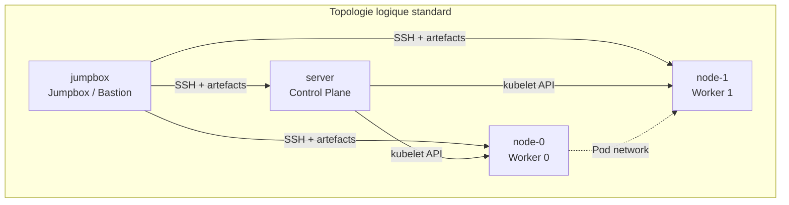
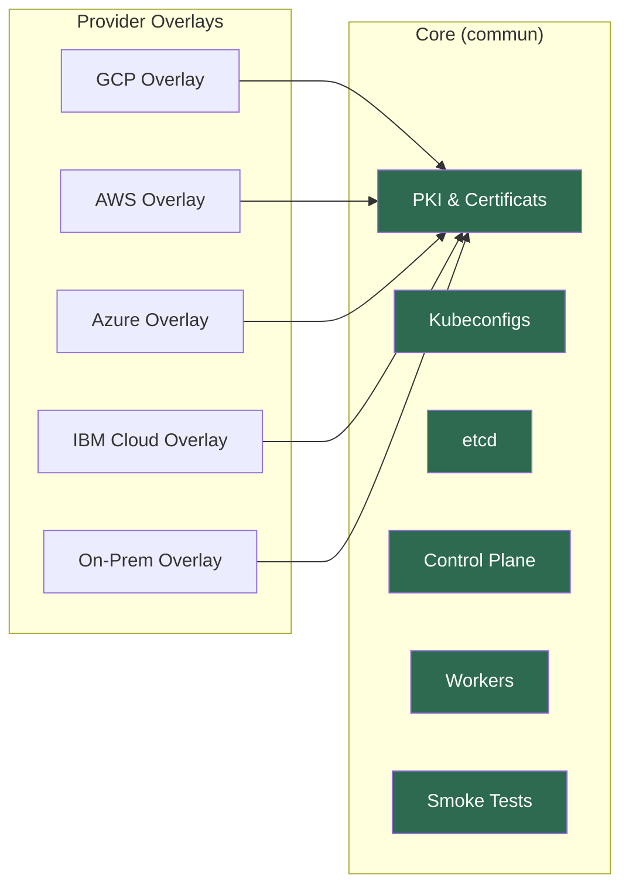
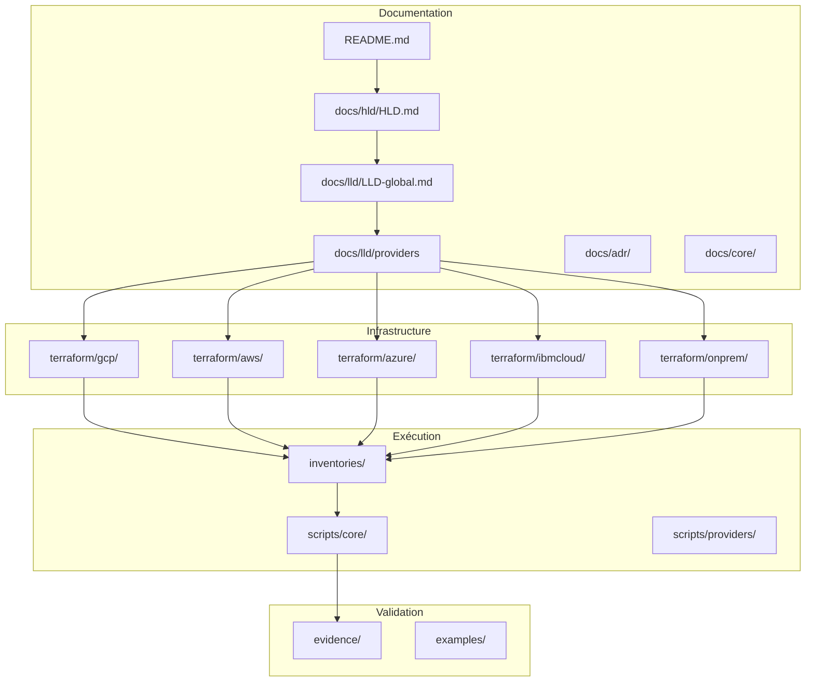

# Kubernetes The Hard Way — Multi-Cloud

> Déployer Kubernetes from scratch, à la main, sur cinq environnements d'infrastructure distincts, avec une démarche d'architecture industrielle.

---

## Vision

Ce dépôt propose une approche structurée et reproductible du déploiement manuel de Kubernetes, inspirée de la philosophie *Kubernetes The Hard Way* de Kelsey Hightower, mais repensée avec une **vraie démarche d'architecture technique** : mutualisation du socle commun, isolation des écarts d'infrastructure dans des overlays provider, documentation HLD/LLD complète, et preuves d'exécution systématiques.

L'objectif n'est pas de fournir un énième tutoriel copié-collé, mais de construire un **actif d'architecture réutilisable**, un **laboratoire expert multi-cloud** et une **fondation pédagogique avancée** pour tout architecte, tech lead ou ingénieur plateforme souhaitant maîtriser les mécanismes internes de Kubernetes.

---

## Contexte

Les déploiements Kubernetes managés (EKS, AKS, GKE, ROKS, OpenShift) masquent la complexité réelle du control plane, de la PKI, du bootstrapping des workers et de la configuration réseau. Cette abstraction est souhaitable en production, mais elle crée un angle mort pour les architectes et les ingénieurs plateforme qui doivent prendre des décisions structurantes sur des sujets qu'ils n'ont jamais manipulés directement.

Ce dépôt comble ce manque en proposant un parcours complet, documenté et multi-cloud, qui expose chaque composant, chaque certificat, chaque fichier de configuration, et chaque décision d'architecture.

---

## Objectifs

| # | Objectif | Description |
|---|----------|-------------|
| 1 | **Compréhension profonde** | Maîtriser chaque composant du control plane et du data plane Kubernetes |
| 2 | **Reproductibilité multi-cloud** | Déployer le même cluster sur on-prem, AWS, Azure, GCP et IBM Cloud |
| 3 | **Mutualisation architecturale** | Factoriser le socle commun et isoler les spécificités provider |
| 4 | **Documentation d'architecture** | Fournir un HLD, un LLD global et des LLD par provider |
| 5 | **Preuves d'exécution** | Documenter chaque étape avec des captures et des logs vérifiables |
| 6 | **Base d'industrialisation** | Servir de fondation pour une trajectoire d'automatisation progressive |

---

## Ce que ce dépôt est

- Un **actif d'architecture** documenté selon les standards HLD/LLD
- Un **laboratoire expert** pour comprendre Kubernetes de l'intérieur
- Une **base pédagogique avancée** pour architectes et ingénieurs plateforme
- Une **fondation d'industrialisation** multi-cloud avec séparation core/overlays
- Un **dépôt de référence** structuré, versionné et maintenable

## Ce que ce dépôt n'est pas

- Un tutoriel copié-collé d'un projet existant
- Une solution "production ready" clé en main
- Un framework d'automatisation complet (GitOps, service mesh, observabilité)
- Un remplacement des offres Kubernetes managées
- Un guide de hardening sécurité complet

---

## Cibles supportées

| Provider | Type | Statut V1 |
|----------|------|-----------|
| **On-Premises** | Bare metal / VMs locales (libvirt, VirtualBox, Proxmox) | Prévu |
| **Google Cloud Platform (GCP)** | Compute Engine | Prévu |
| **Amazon Web Services (AWS)** | EC2 | Prévu |
| **Microsoft Azure** | Virtual Machines | Prévu |
| **IBM Cloud** | Virtual Servers (VPC) | Prévu |

---

## Principes d'architecture

Les principes suivants gouvernent l'ensemble du dépôt et des décisions techniques associées :

1. **Mutualisation du socle commun** — Tout ce qui est indépendant du provider (PKI, kubeconfigs, configuration etcd, control plane, workers) est factorisé dans un noyau `core/` partagé.

2. **Isolation des écarts d'infrastructure** — Les spécificités de chaque provider (provisionnement réseau, compute, sécurité, DNS) sont encapsulées dans des overlays `providers/<provider>/` dédiés.

3. **Topologie logique standard** — Chaque déploiement repose sur la même topologie logique, quel que soit le provider, garantissant la comparabilité et la reproductibilité.

4. **Documentation avant code** — Le HLD et les LLD sont rédigés avant l'implémentation. Le code est une traduction des décisions d'architecture, pas l'inverse.

5. **Preuves d'exécution systématiques** — Chaque étape produit des preuves vérifiables (logs, captures, résultats de commandes) stockées dans `evidence/`.

6. **Progression incrémentale** — Le dépôt évolue par versions successives (V1, V2, V3...) avec un périmètre clairement défini pour chaque itération.

7. **Conventions strictes** — Nommage, structure des répertoires, format des variables et des inventaires suivent des conventions documentées et appliquées uniformément.

---

## Topologie logique standard

Chaque déploiement, quel que soit le provider, repose sur la topologie suivante :

| Rôle | Hostname | Description |
|------|----------|-------------|
| **Jumpbox** | `jumpbox` | Point d'entrée SSH, génération PKI, distribution des artefacts |
| **Control Plane** | `server` | API Server, Controller Manager, Scheduler, etcd |
| **Worker 0** | `node-0` | Kubelet, kube-proxy, containerd |
| **Worker 1** | `node-1` | Kubelet, kube-proxy, containerd |



---

## Stratégie Core vs Provider Overlays

Le dépôt sépare clairement le **noyau commun** (core) des **spécificités provider** (overlays) :



**Principe** : chaque overlay provider ne contient que le provisionnement d'infrastructure (réseau, compute, firewall, DNS) et l'inventory associé. Une fois les machines provisionnées et l'inventory généré, le flux d'exécution rejoint le noyau commun.

---

## Structure du dépôt

```
kubernetes-the-hard-way-multicloud/
├── README.md                          # Ce fichier
├── docs/
│   ├── hld/
│   │   └── HLD.md                     # High Level Design
│   ├── lld/
│   │   ├── LLD-global.md             # Low Level Design global
│   │   ├── gcp.md                     # LLD Google Cloud Platform
│   │   ├── aws.md                     # LLD Amazon Web Services
│   │   ├── azure.md                   # LLD Microsoft Azure
│   │   ├── ibmcloud.md               # LLD IBM Cloud
│   │   └── onprem.md                 # LLD On-Premises
│   ├── adr/                           # Architecture Decision Records
│   ├── core/                          # Documentation des étapes core
│   └── providers/                     # Documentation spécifique providers
├── terraform/                         # Modules Terraform par provider
├── scripts/                           # Scripts d'exécution (core + providers)
├── inventories/                       # Inventaires par provider
├── examples/                          # Exemples de configurations
└── evidence/                          # Preuves d'exécution
```

---

## Ordre de lecture recommandé

Pour une compréhension progressive et structurée, il est recommandé de lire les documents dans l'ordre suivant :

| Étape | Document | Objectif |
|-------|----------|----------|
| 1 | `README.md` | Vue d'ensemble du projet |
| 2 | `docs/hld/HLD.md` | Comprendre l'architecture de haut niveau |
| 3 | `docs/lld/LLD-global.md` | Comprendre la mécanique interne du dépôt |
| 4 | `docs/lld/<provider>.md` | Comprendre les spécificités du provider choisi |
| 5 | `docs/core/` | Suivre les étapes core pas à pas |
| 6 | `evidence/` | Vérifier les preuves d'exécution |

---

## Roadmap

| Version | Périmètre | Statut |
|---------|-----------|--------|
| **V1** | Provisionnement minimal, PKI, kubeconfigs, chiffrement secrets, etcd, control plane, workers, smoke tests, cleanup, documentation HLD/LLD, preuves d'exécution | En cours |
| **V2** | Automatisation Ansible, CI/CD basique, monitoring Prometheus/Grafana, NetworkPolicies | Planifié |
| **V3** | HA control plane, stockage persistant (CSI), service mesh (Cilium/Istio), GitOps (ArgoCD) | Planifié |
| **V4** | Hardening sécurité, conformité CIS Benchmark, IAM/OIDC, audit logging | Planifié |

---

## Statut du projet

| Élément | Statut |
|---------|--------|
| Documentation HLD | Rédigé |
| Documentation LLD global | Rédigé |
| Documentation LLD providers | Rédigé |
| Scripts core | En cours |
| Terraform providers | En cours |
| Preuves d'exécution | En cours |

---

## Conventions

### Nommage

- Les hostnames suivent la convention : `jumpbox`, `server`, `node-0`, `node-1`
- Les répertoires Terraform sont nommés par provider : `terraform/gcp/`, `terraform/aws/`, etc.
- Les scripts core sont préfixés par leur ordre d'exécution : `01-pki.sh`, `02-kubeconfigs.sh`, etc.
- Les variables d'environnement sont en `SCREAMING_SNAKE_CASE`
- Les fichiers d'inventory suivent le format : `inventories/<provider>/inventory.env`

### Branches

- `main` : branche stable, documentée et testée
- `develop` : branche d'intégration
- `feature/<nom>` : branches de développement

### Commits

Les messages de commit suivent la convention [Conventional Commits](https://www.conventionalcommits.org/) :

```
<type>(<scope>): <description>

Exemples :
docs(hld): add initial High Level Design
feat(pki): implement certificate generation script
fix(terraform/gcp): correct firewall rule for API server
```

---

## Architecture du dépôt



---

## Auteur

**Zidane Djamal**
Architecte technique senior, spécialisé en transformation Cloud Native, Kubernetes/OpenShift, modernisation de plateformes critiques, standardisation multi-environnements et industrialisation progressive.

- GitHub : [github.com/zdmooc](https://github.com/zdmooc)

---

## Licence

Ce projet est distribué sous licence [MIT](LICENSE).

---

> *Ce dépôt est un actif d'architecture vivant. Il évolue par itérations successives, chaque version apportant un niveau supplémentaire de maturité, d'automatisation et de couverture.*
