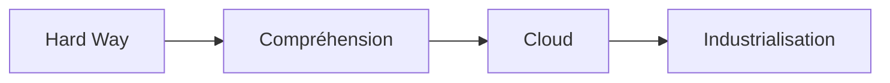
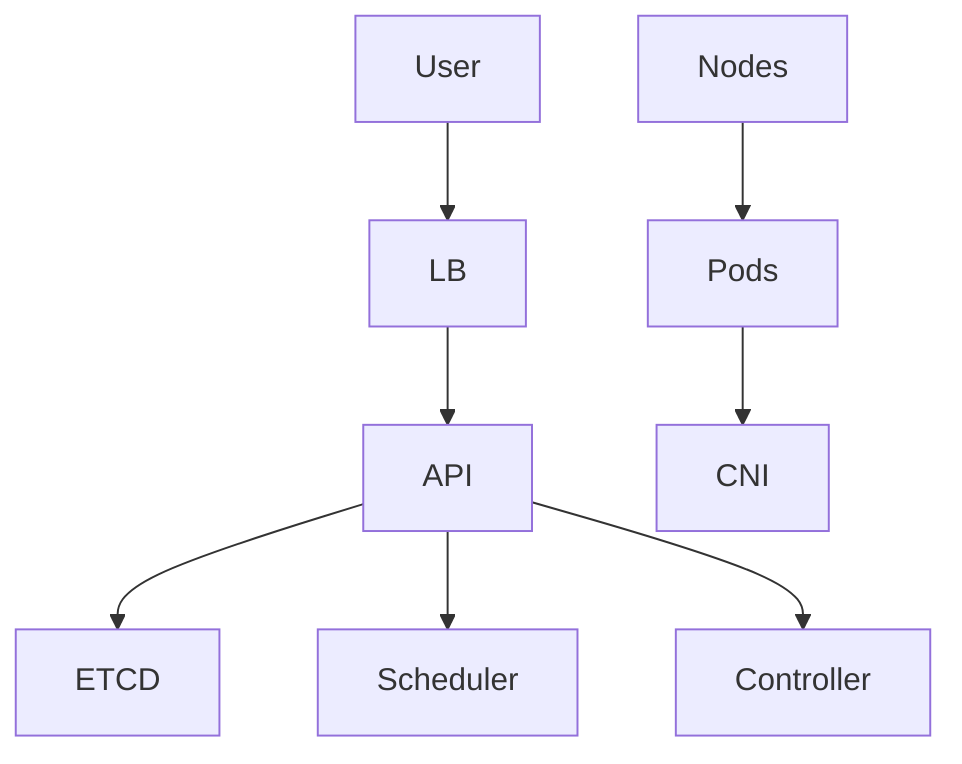
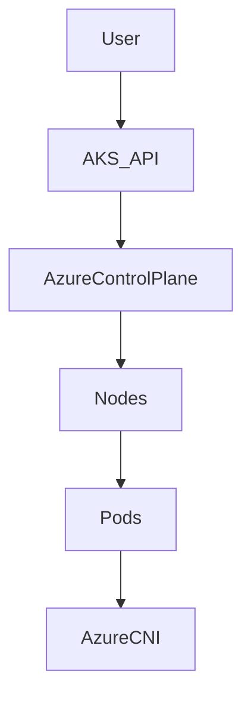
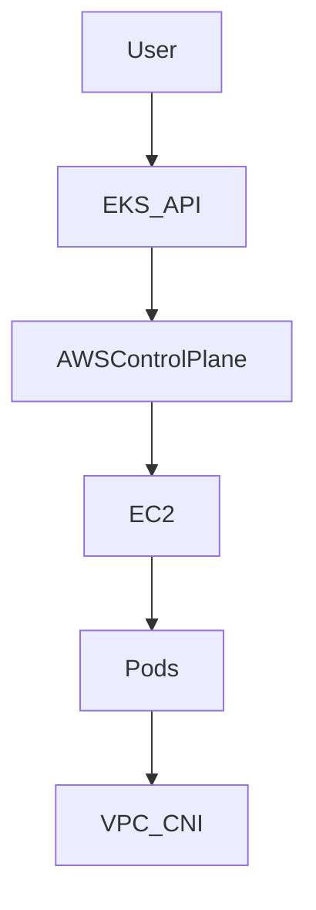
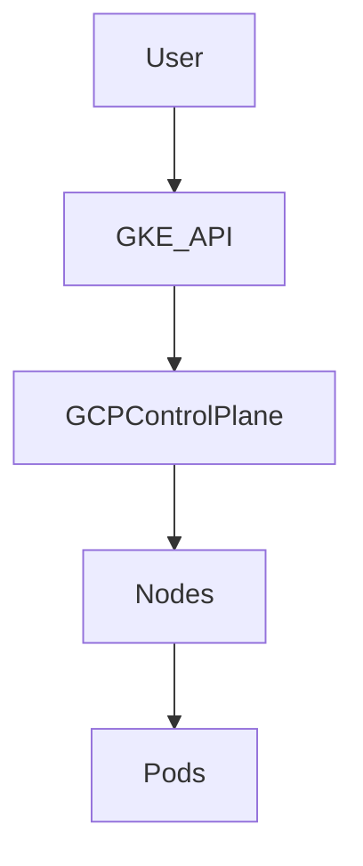

# Kubernetes V6 – Spécialisation Cloud & On-Prem (à partir du Hard Way)

## Objectif
Transformer la compréhension acquise avec **Kubernetes The Hard Way** en capacité d’architecture et d’audit sur :
- On-Prem
- Azure (AKS)
- AWS (EKS)
- GCP (GKE)

---

# 🧭 1. Principe fondamental

👉 Hard Way = comprendre **toutes les briques**
👉 Cloud = comprendre **ce qui est abstrait**



---

# 🏗️ 2. Mapping global Hard Way → Cloud

| Brique | Hard Way | Cloud managé |
|-------|---------|-------------|
| etcd | manuel | caché |
| API server | manuel | caché |
| scheduler | manuel | caché |
| controller-manager | manuel | caché |
| nodes | manuel | géré partiellement |
| réseau | manuel | plugin cloud |
| LB | manuel | LB cloud |
| stockage | manuel | CSI cloud |

👉 Le **control plane disparaît** en cloud.

---

# 🧱 3. ON-PREM (Hard Way étendu)

## Architecture



## Tu gères
- etcd
- API server
- scheduler
- controller
- kubelet
- réseau
- stockage

## Ajouts obligatoires
- Ingress (NGINX / Traefik)
- CSI (Ceph / NFS)
- monitoring
- logging

## Audit
- certificats
- etcd backup
- CNI
- HA

---

# ☁️ 4. AZURE AKS

## Architecture



## Ce qui disparaît
- etcd
- API server
- scheduler
- controller-manager

## Ce que tu gères
- nodes
- workloads
- sécurité

## Commandes
```bash
az aks create --resource-group rg --name aks --node-count 2
az aks get-credentials --resource-group rg --name aks
```

## Spécificités
- Azure CNI
- Managed Identity
- NSG

## Audit
- RBAC Azure AD
- réseau VNet
- quotas

---

# ☁️ 5. AWS EKS

## Architecture



## Commande
```bash
eksctl create cluster --name eks-cluster
```

## Spécificités
- IAM
- Security Groups
- VPC

## Audit
- IAM mapping
- network
- autoscaling

---

# ☁️ 6. GCP GKE

## Architecture



## Commande
```bash
gcloud container clusters create gke-cluster --num-nodes=2
```

## Spécificités
- Workload Identity
- Autopilot

## Audit
- IAM
- quotas
- réseau

---

# 🔥 7. Comparaison

| Critère | On-Prem | AKS | EKS | GKE |
|--------|--------|-----|-----|-----|
| contrôle | total | partiel | partiel | faible |
| complexité | élevée | moyenne | moyenne | faible |
| maintenance | élevée | faible | moyenne | faible |

---

# 🧠 8. Vision architecte

👉 On-Prem = maîtrise technique totale
👉 Cloud = maîtrise des abstractions

---

# 🔍 9. Audit multi-environnement

## On-Prem
- etcd
- certs
- control plane

## Cloud
- IAM
- réseau
- coût

---

# 🏁 Conclusion

👉 Hard Way → comprendre Kubernetes
👉 Cloud → exploiter Kubernetes à l’échelle

---

# 🚀 Suite possible

- audit cloud complet
- scénarios réels entreprise
- optimisation coûts / sécurité

