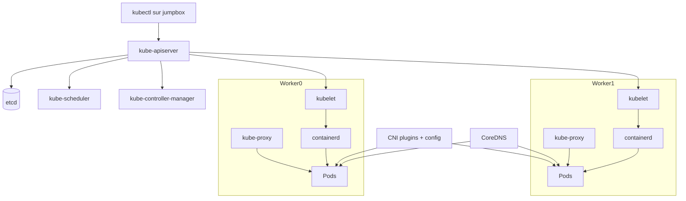
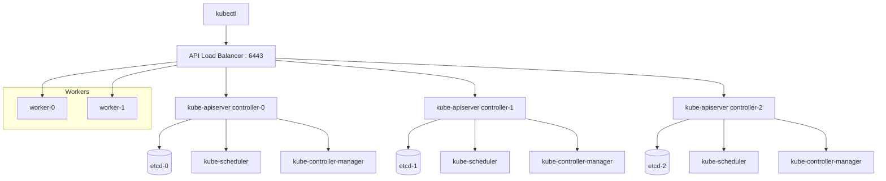

# Kubernetes The Hard Way – Guide Générique Architecte (A → Z) – V2

## Objectif
Construire un cluster Kubernetes **manuellement**, sans scripts ni Terraform, avec uniquement des **commandes**, des **binaires**, des **fichiers de configuration** et des **unités systemd**, afin de comprendre chaque couche jusqu’au niveau **audit / expert N3**.

---

# 1. Ce que ce guide est… et n’est pas

Ce guide est :
- un **parcours d’apprentissage profond**,
- un **runbook manuel**,
- un support pour comprendre chaque brique Kubernetes,
- une base pour aller vers l’audit.

Ce guide n’est pas :
- un installateur automatisé,
- une méthode de déploiement la plus rapide,
- une architecture de production prête à l’emploi sans adaptation.

👉 Le principe est simple :
**on monte chaque brique à la main pour comprendre tout l’édifice.**

---

# 2. Architecture cible de ce guide

## 2.1 Topologie retenue
Pour un Hard Way générique pédagogique, on retient :
- 1 machine d’administration (`jumpbox` ou poste admin),
- 1 control plane,
- 2 worker nodes.

Cela correspond à un cluster minimal mais suffisant pour voir tous les mécanismes.

## 2.2 Nommage recommandé
- `jumpbox`
- `controller-0`
- `worker-0`
- `worker-1`

## 2.3 Schéma global


---

# 3. Pré-requis avant toute commande

## 3.1 Prérequis machines
Pour rester dans une base compatible avec les recommandations officielles modernes :
- hôtes Linux compatibles,
- **2 Go de RAM minimum par machine**,
- **2 vCPU minimum pour le control plane**,
- connectivité réseau complète entre toutes les machines,
- hostname, MAC address et `product_uuid` uniques,
- ports requis ouverts,
- swap désactivé ou explicitement géré. 

## 3.2 Commandes de vérification

### Hostname
```bash
hostnamectl
hostname -f
```

### MAC
```bash
ip link
```

### product_uuid
```bash
sudo cat /sys/class/dmi/id/product_uuid
```

### Mémoire / CPU
```bash
free -h
nproc
lscpu
```

### Réseau
```bash
ip addr
ip route
ping -c 2 <autre-noeud>
```

### Swap
```bash
swapon --show
sudo swapoff -a
```

---

# 4. Plan d’adressage à définir avant de commencer

Tu dois figer dès le départ :
- IP de chaque machine,
- subnet Pods,
- subnet Services,
- plage DNS interne,
- nom DNS ou IP de l’API server.

## 4.1 Exemple générique
- `controller-0` : `10.0.0.10`
- `worker-0` : `10.0.0.20`
- `worker-1` : `10.0.0.21`
- API endpoint : `10.0.0.10` ou nom DNS `kubernetes.local`
- Pod CIDR : `10.200.0.0/16`
- Service CIDR : `10.32.0.0/24`

## 4.2 Pourquoi c’est essentiel
Parce que ces valeurs vont être injectées dans :
- les certificats,
- les kubeconfigs,
- la config API server,
- la config réseau CNI,
- les routes Pod.

---

# 5. Binaires à installer et rôle de chacun

## 5.1 Binaires Kubernetes
- `kube-apiserver` : API centrale
- `kube-controller-manager` : contrôleurs de réconciliation
- `kube-scheduler` : placement des Pods
- `kubelet` : agent node
- `kube-proxy` : dataplane Service côté node
- `kubectl` : client d’administration

## 5.2 Autres binaires
- `etcd` : base de données cluster
- `containerd` : runtime CRI
- plugins **CNI** : réseau Pods
- `crictl` : debug runtime
- `cfssl` / `cfssljson` ou `openssl` : PKI

## 5.3 Emplacements standards
```bash
/usr/local/bin/kube-apiserver
/usr/local/bin/kube-controller-manager
/usr/local/bin/kube-scheduler
/usr/local/bin/kubelet
/usr/local/bin/kube-proxy
/usr/local/bin/kubectl
/usr/local/bin/etcd
/usr/local/bin/etcdctl
/usr/local/bin/containerd
/usr/local/bin/ctr
/usr/local/bin/crictl
```

## 5.4 Emplacements de configuration
```bash
/etc/kubernetes/
/etc/cni/net.d/
/opt/cni/bin/
/var/lib/kubelet/
/var/lib/kube-proxy/
/var/lib/kubernetes/
/var/lib/etcd/
/etc/containerd/
```

---

# 6. Versions et stratégie de téléchargement

## 6.1 Stratégie recommandée
Pour éviter les dérives, fixe explicitement :
- version Kubernetes,
- version etcd,
- version containerd,
- version CNI plugins.

## 6.2 Exemple de variables
```bash
KUBERNETES_VERSION="v1.32.0"
ETCD_VERSION="v3.6.0"
CONTAINERD_VERSION="2.1.0"
CNI_VERSION="v1.6.2"
ARCH="amd64"
```

## 6.3 Pourquoi faire ainsi
- cohérence entre nœuds,
- reproductibilité,
- facilité d’audit,
- compatibilité mieux maîtrisée.

---

# 7. Préparer la jumpbox / machine d’administration

## 7.1 Rôle
La jumpbox sert à :
- générer les certificats,
- générer les kubeconfigs,
- copier les binaires et configs,
- exécuter `kubectl`.

## 7.2 Répertoires de travail
```bash
mkdir -p ~/kthw/{downloads,certs,kubeconfigs,configs,units}
cd ~/kthw
```

## 7.3 Installer kubectl
```bash
curl -LO "https://dl.k8s.io/release/${KUBERNETES_VERSION}/bin/linux/${ARCH}/kubectl"
chmod +x kubectl
sudo mv kubectl /usr/local/bin/
```

## 7.4 Installer cfssl (option recommandée pour Hard Way)
```bash
curl -LO https://pkg.cfssl.org/R1.2/cfssl_linux-amd64
curl -LO https://pkg.cfssl.org/R1.2/cfssljson_linux-amd64
chmod +x cfssl_linux-amd64 cfssljson_linux-amd64
sudo mv cfssl_linux-amd64 /usr/local/bin/cfssl
sudo mv cfssljson_linux-amd64 /usr/local/bin/cfssljson
```

## 7.5 Vérifier
```bash
kubectl version --client
cfssl version
```

---

# 8. Préparer les nœuds controller et workers

## 8.1 Créer les répertoires standards
Sur **controller-0**, **worker-0** et **worker-1** :
```bash
sudo mkdir -p /etc/kubernetes /var/lib/kubernetes /var/lib/kubelet /var/lib/kube-proxy
sudo mkdir -p /etc/cni/net.d /opt/cni/bin /var/lib/etcd /etc/containerd
```

## 8.2 Désactiver le swap
```bash
sudo swapoff -a
```

## 8.3 Vérifier connectivité
Depuis chaque nœud :
```bash
ping -c 2 10.0.0.10
ping -c 2 10.0.0.20
ping -c 2 10.0.0.21
```

---

# 9. Installer containerd sur tous les nœuds

## 9.1 Télécharger et extraire
Sur chaque nœud :
```bash
cd /tmp
curl -LO "https://github.com/containerd/containerd/releases/download/v${CONTAINERD_VERSION}/containerd-${CONTAINERD_VERSION}-linux-${ARCH}.tar.gz"
sudo tar -C /usr/local -xzf "containerd-${CONTAINERD_VERSION}-linux-${ARCH}.tar.gz"
```

## 9.2 Générer la configuration
```bash
sudo mkdir -p /etc/containerd
containerd config default | sudo tee /etc/containerd/config.toml > /dev/null
```

## 9.3 Ajuster SystemdCgroup
Éditer `/etc/containerd/config.toml` et positionner :
```toml
SystemdCgroup = true
```

## 9.4 Installer l’unité systemd
```bash
curl -LO https://raw.githubusercontent.com/containerd/containerd/main/containerd.service
sudo mv containerd.service /etc/systemd/system/
sudo systemctl daemon-reload
sudo systemctl enable --now containerd
```

## 9.5 Vérifier
```bash
systemctl status containerd --no-pager
sudo ctr version
```

---

# 10. Installer les plugins CNI sur les workers

## 10.1 Télécharger et extraire
Sur `worker-0` et `worker-1` :
```bash
cd /tmp
curl -LO "https://github.com/containernetworking/plugins/releases/download/${CNI_VERSION}/cni-plugins-linux-${ARCH}-${CNI_VERSION}.tgz"
sudo tar -C /opt/cni/bin -xzf "cni-plugins-linux-${ARCH}-${CNI_VERSION}.tgz"
```

## 10.2 Vérifier
```bash
ls -1 /opt/cni/bin
```

### Pourquoi cette étape
Sans plugins CNI, le kubelet peut lancer des conteneurs, mais les Pods n’auront pas de réseau Kubernetes utilisable.

---

# 11. Télécharger les binaires Kubernetes et etcd

## 11.1 Sur controller-0
```bash
cd /tmp
curl -LO "https://dl.k8s.io/release/${KUBERNETES_VERSION}/bin/linux/${ARCH}/kube-apiserver"
curl -LO "https://dl.k8s.io/release/${KUBERNETES_VERSION}/bin/linux/${ARCH}/kube-controller-manager"
curl -LO "https://dl.k8s.io/release/${KUBERNETES_VERSION}/bin/linux/${ARCH}/kube-scheduler"
curl -LO "https://dl.k8s.io/release/${KUBERNETES_VERSION}/bin/linux/${ARCH}/kubectl"
curl -LO "https://github.com/etcd-io/etcd/releases/download/${ETCD_VERSION}/etcd-${ETCD_VERSION}-linux-${ARCH}.tar.gz"
chmod +x kube-apiserver kube-controller-manager kube-scheduler kubectl
sudo mv kube-apiserver kube-controller-manager kube-scheduler kubectl /usr/local/bin/
tar -xzf "etcd-${ETCD_VERSION}-linux-${ARCH}.tar.gz"
sudo mv etcd-${ETCD_VERSION}-linux-${ARCH}/etcd* /usr/local/bin/
```

## 11.2 Sur worker-0 et worker-1
```bash
cd /tmp
curl -LO "https://dl.k8s.io/release/${KUBERNETES_VERSION}/bin/linux/${ARCH}/kubelet"
curl -LO "https://dl.k8s.io/release/${KUBERNETES_VERSION}/bin/linux/${ARCH}/kube-proxy"
chmod +x kubelet kube-proxy
sudo mv kubelet kube-proxy /usr/local/bin/
```

## 11.3 Vérifier
```bash
kubelet --version
kube-proxy --version
kube-apiserver --version
etcd --version
```

---

# 12. Générer la CA et les certificats TLS

## 12.1 Pourquoi
Tous les composants critiques se parlent en TLS.
Il faut une **CA** qui signe les certificats client/serveur.

## 12.2 Créer la CA
Sur la jumpbox :
```bash
cat > ca-config.json <<'EOF'
{
  "signing": {
    "default": {
      "expiry": "8760h"
    },
    "profiles": {
      "kubernetes": {
        "usages": [
          "signing",
          "key encipherment",
          "server auth",
          "client auth"
        ],
        "expiry": "8760h"
      }
    }
  }
}
EOF

cat > ca-csr.json <<'EOF'
{
  "CN": "Kubernetes",
  "key": {
    "algo": "rsa",
    "size": 2048
  },
  "names": [
    {
      "C": "FR",
      "L": "Paris",
      "O": "Kubernetes",
      "OU": "CA",
      "ST": "IDF"
    }
  ]
}
EOF

cfssl gencert -initca ca-csr.json | cfssljson -bare ca
```

## 12.3 Générer les certificats nécessaires
Tu dois générer au minimum :
- `admin`
- `kube-controller-manager`
- `kube-scheduler`
- `kube-proxy` si utilisé avec kubeconfig dédié
- `worker-0`
- `worker-1`
- `kubernetes` (API server)
- `service-account`
- `etcd-server`, `etcd-peer`, `etcd-healthcheck-client`

## 12.4 Exemple pour admin
```bash
cat > admin-csr.json <<'EOF'
{
  "CN": "admin",
  "key": {
    "algo": "rsa",
    "size": 2048
  },
  "names": [
    {
      "C": "FR",
      "L": "Paris",
      "O": "system:masters",
      "OU": "Kubernetes The Hard Way",
      "ST": "IDF"
    }
  ]
}
EOF

cfssl gencert \
  -ca=ca.pem \
  -ca-key=ca-key.pem \
  -config=ca-config.json \
  -profile=kubernetes \
  admin-csr.json | cfssljson -bare admin
```

## 12.5 API server certificate
Le certificat API server doit inclure en SAN :
- IP du controller,
- IP du Service Kubernetes (souvent première IP du Service CIDR),
- éventuellement nom DNS API.

### Pourquoi
Sinon les clients refuseront le certificat.

---

# 13. Générer les kubeconfigs

## 13.1 Pourquoi
Chaque composant client de l’API a besoin de :
- l’endpoint API,
- la CA,
- son certificat ou token.

## 13.2 Exemples à produire
- `admin.kubeconfig`
- `kube-controller-manager.kubeconfig`
- `kube-scheduler.kubeconfig`
- `worker-0.kubeconfig`
- `worker-1.kubeconfig`

## 13.3 Exemple générique
Sur la jumpbox :
```bash
kubectl config set-cluster kubernetes-the-hard-way \
  --certificate-authority=ca.pem \
  --embed-certs=true \
  --server=https://10.0.0.10:6443 \
  --kubeconfig=admin.kubeconfig

kubectl config set-credentials admin \
  --client-certificate=admin.pem \
  --client-key=admin-key.pem \
  --embed-certs=true \
  --kubeconfig=admin.kubeconfig

kubectl config set-context default \
  --cluster=kubernetes-the-hard-way \
  --user=admin \
  --kubeconfig=admin.kubeconfig

kubectl config use-context default --kubeconfig=admin.kubeconfig
```

---

# 14. Générer la clé de chiffrement des Secrets

## 14.1 Pourquoi
Pour chiffrer les données sensibles stockées dans etcd.

## 14.2 Commande
Sur la jumpbox :
```bash
ENCRYPTION_KEY=$(head -c 32 /dev/urandom | base64)
```

## 14.3 Fichier de configuration
```bash
cat > encryption-config.yaml <<EOF
kind: EncryptionConfig
apiVersion: v1
resources:
  - resources:
      - secrets
    providers:
      - aescbc:
          keys:
            - name: key1
              secret: ${ENCRYPTION_KEY}
      - identity: {}
EOF
```

---

# 15. Distribuer certificats, kubeconfigs et configs

## 15.1 Vers controller-0
Copier :
- CA
- certs API server
- certs etcd
- certs service-account
- kubeconfigs admin/controller-manager/scheduler
- encryption-config

## 15.2 Vers workers
Copier :
- CA
- certs worker
- kubeconfig worker

### Exemple
```bash
scp ca.pem worker-0.pem worker-0-key.pem worker-0.kubeconfig user@10.0.0.20:/tmp/
scp ca.pem worker-1.pem worker-1-key.pem worker-1.kubeconfig user@10.0.0.21:/tmp/
scp ca.pem kubernetes.pem kubernetes-key.pem service-account.pem service-account-key.pem admin.kubeconfig kube-controller-manager.kubeconfig kube-scheduler.kubeconfig encryption-config.yaml user@10.0.0.10:/tmp/
```

---

# 16. Bootstrap etcd sur le controller

## 16.1 Poser les fichiers
Sur `controller-0` :
```bash
sudo mv /tmp/ca.pem /var/lib/kubernetes/
sudo mv /tmp/kubernetes.pem /var/lib/kubernetes/
sudo mv /tmp/kubernetes-key.pem /var/lib/kubernetes/
```

Pour etcd, pose les certs dédiés dans `/etc/etcd/` ou `/var/lib/etcd/` selon ton organisation.

## 16.2 Unité systemd etcd
Créer `/etc/systemd/system/etcd.service` :
```ini
[Unit]
Description=etcd
Documentation=https://etcd.io
After=network.target

[Service]
ExecStart=/usr/local/bin/etcd \
  --name controller-0 \
  --cert-file=/var/lib/etcd/etcd-server.pem \
  --key-file=/var/lib/etcd/etcd-server-key.pem \
  --peer-cert-file=/var/lib/etcd/etcd-peer.pem \
  --peer-key-file=/var/lib/etcd/etcd-peer-key.pem \
  --trusted-ca-file=/var/lib/etcd/ca.pem \
  --peer-trusted-ca-file=/var/lib/etcd/ca.pem \
  --client-cert-auth \
  --peer-client-cert-auth \
  --initial-advertise-peer-urls https://10.0.0.10:2380 \
  --listen-peer-urls https://10.0.0.10:2380 \
  --listen-client-urls https://10.0.0.10:2379,https://127.0.0.1:2379 \
  --advertise-client-urls https://10.0.0.10:2379 \
  --initial-cluster controller-0=https://10.0.0.10:2380 \
  --initial-cluster-state new \
  --data-dir=/var/lib/etcd
Restart=on-failure
RestartSec=5

[Install]
WantedBy=multi-user.target
```

## 16.3 Démarrer
```bash
sudo systemctl daemon-reload
sudo systemctl enable --now etcd
systemctl status etcd --no-pager
```

## 16.4 Vérifier etcd
```bash
ETCDCTL_API=3 etcdctl \
  --endpoints=https://127.0.0.1:2379 \
  --cacert=/var/lib/etcd/ca.pem \
  --cert=/var/lib/etcd/etcd-healthcheck-client.pem \
  --key=/var/lib/etcd/etcd-healthcheck-client-key.pem \
  endpoint health
```

---

# 17. Bootstrap du control plane

## 17.1 kube-apiserver

### Fichiers nécessaires
- CA
- cert API server
- clé API server
- kubeconfig admin éventuellement pour debug
- `encryption-config.yaml`
- certs service-account

### Unité systemd `/etc/systemd/system/kube-apiserver.service`
```ini
[Unit]
Description=Kubernetes API Server
Documentation=https://kubernetes.io/docs/home/
After=network.target etcd.service

[Service]
ExecStart=/usr/local/bin/kube-apiserver \
  --advertise-address=10.0.0.10 \
  --allow-privileged=true \
  --authorization-mode=Node,RBAC \
  --client-ca-file=/var/lib/kubernetes/ca.pem \
  --enable-admission-plugins=NodeRestriction,ServiceAccount \
  --enable-bootstrap-token-auth=true \
  --encryption-provider-config=/var/lib/kubernetes/encryption-config.yaml \
  --etcd-cafile=/var/lib/etcd/ca.pem \
  --etcd-certfile=/var/lib/etcd/etcd-healthcheck-client.pem \
  --etcd-keyfile=/var/lib/etcd/etcd-healthcheck-client-key.pem \
  --etcd-servers=https://127.0.0.1:2379 \
  --kubelet-certificate-authority=/var/lib/kubernetes/ca.pem \
  --kubelet-client-certificate=/var/lib/kubernetes/kubernetes.pem \
  --kubelet-client-key=/var/lib/kubernetes/kubernetes-key.pem \
  --proxy-client-cert-file=/var/lib/kubernetes/kubernetes.pem \
  --proxy-client-key-file=/var/lib/kubernetes/kubernetes-key.pem \
  --requestheader-client-ca-file=/var/lib/kubernetes/ca.pem \
  --requestheader-allowed-names=kubernetes \
  --requestheader-extra-headers-prefix=X-Remote-Extra- \
  --requestheader-group-headers=X-Remote-Group \
  --requestheader-username-headers=X-Remote-User \
  --runtime-config='api/all=true' \
  --service-account-key-file=/var/lib/kubernetes/service-account.pem \
  --service-account-signing-key-file=/var/lib/kubernetes/service-account-key.pem \
  --service-account-issuer=https://10.0.0.10:6443 \
  --service-cluster-ip-range=10.32.0.0/24 \
  --service-node-port-range=30000-32767 \
  --tls-cert-file=/var/lib/kubernetes/kubernetes.pem \
  --tls-private-key-file=/var/lib/kubernetes/kubernetes-key.pem \
  --v=2
Restart=on-failure
RestartSec=5

[Install]
WantedBy=multi-user.target
```

## 17.2 kube-controller-manager
Créer `/etc/systemd/system/kube-controller-manager.service` :
```ini
[Unit]
Description=Kubernetes Controller Manager
Documentation=https://kubernetes.io/docs/home/
After=network.target kube-apiserver.service

[Service]
ExecStart=/usr/local/bin/kube-controller-manager \
  --bind-address=127.0.0.1 \
  --cluster-cidr=10.200.0.0/16 \
  --cluster-name=kubernetes \
  --cluster-signing-cert-file=/var/lib/kubernetes/ca.pem \
  --cluster-signing-key-file=/var/lib/kubernetes/ca-key.pem \
  --kubeconfig=/var/lib/kubernetes/kube-controller-manager.kubeconfig \
  --leader-elect=true \
  --root-ca-file=/var/lib/kubernetes/ca.pem \
  --service-account-private-key-file=/var/lib/kubernetes/service-account-key.pem \
  --service-cluster-ip-range=10.32.0.0/24 \
  --use-service-account-credentials=true \
  --v=2
Restart=on-failure
RestartSec=5

[Install]
WantedBy=multi-user.target
```

## 17.3 kube-scheduler
Créer `/etc/systemd/system/kube-scheduler.service` :
```ini
[Unit]
Description=Kubernetes Scheduler
Documentation=https://kubernetes.io/docs/home/
After=network.target kube-apiserver.service

[Service]
ExecStart=/usr/local/bin/kube-scheduler \
  --kubeconfig=/var/lib/kubernetes/kube-scheduler.kubeconfig \
  --leader-elect=true \
  --v=2
Restart=on-failure
RestartSec=5

[Install]
WantedBy=multi-user.target
```

## 17.4 Démarrer le control plane
```bash
sudo systemctl daemon-reload
sudo systemctl enable --now kube-apiserver kube-controller-manager kube-scheduler
systemctl status kube-apiserver --no-pager
systemctl status kube-controller-manager --no-pager
systemctl status kube-scheduler --no-pager
```

## 17.5 Vérifier les health endpoints
```bash
curl -k https://127.0.0.1:6443/healthz
curl -k https://127.0.0.1:6443/livez?verbose
curl -k https://127.0.0.1:6443/readyz?verbose
```

---

# 18. Configurer kubectl sur la jumpbox

## 18.1 Copier le kubeconfig admin
```bash
mkdir -p ~/.kube
cp admin.kubeconfig ~/.kube/config
chmod 600 ~/.kube/config
```

## 18.2 Tester
```bash
kubectl get componentstatuses
kubectl get namespaces
```

---

# 19. Bootstrap des worker nodes

## 19.1 Poser les fichiers
Sur chaque worker :
```bash
sudo mv /tmp/ca.pem /var/lib/kubernetes/
sudo mv /tmp/worker-0.pem /var/lib/kubelet/kubelet.pem
sudo mv /tmp/worker-0-key.pem /var/lib/kubelet/kubelet-key.pem
sudo mv /tmp/worker-0.kubeconfig /var/lib/kubelet/kubeconfig
```

Adapter évidemment `worker-1` sur le second nœud.

## 19.2 Config kubelet
Créer `/var/lib/kubelet/kubelet-config.yaml` sur chaque worker :
```yaml
kind: KubeletConfiguration
apiVersion: kubelet.config.k8s.io/v1beta1
authentication:
  anonymous:
    enabled: false
  webhook:
    enabled: true
  x509:
    clientCAFile: "/var/lib/kubernetes/ca.pem"
authorization:
  mode: Webhook
clusterDomain: "cluster.local"
clusterDNS:
  - "10.32.0.10"
containerRuntimeEndpoint: "unix:///var/run/containerd/containerd.sock"
resolvConf: "/etc/resolv.conf"
runtimeRequestTimeout: "15m"
serverTLSBootstrap: true
```

## 19.3 Unité systemd kubelet
Créer `/etc/systemd/system/kubelet.service` :
```ini
[Unit]
Description=Kubernetes Kubelet
Documentation=https://kubernetes.io/docs/home/
After=containerd.service
Requires=containerd.service

[Service]
ExecStart=/usr/local/bin/kubelet \
  --config=/var/lib/kubelet/kubelet-config.yaml \
  --kubeconfig=/var/lib/kubelet/kubeconfig \
  --hostname-override=$(hostname -s) \
  --node-ip=$(hostname -I | awk '{print $1}') \
  --pod-infra-container-image=registry.k8s.io/pause:3.10 \
  --v=2
Restart=on-failure
RestartSec=5

[Install]
WantedBy=multi-user.target
```

## 19.4 Config kube-proxy
Créer `/var/lib/kube-proxy/kube-proxy-config.yaml` :
```yaml
kind: KubeProxyConfiguration
apiVersion: kubeproxy.config.k8s.io/v1alpha1
clientConnection:
  kubeconfig: "/var/lib/kube-proxy/kubeconfig"
mode: "iptables"
clusterCIDR: "10.200.0.0/16"
```

## 19.5 Unité systemd kube-proxy
Créer `/etc/systemd/system/kube-proxy.service` :
```ini
[Unit]
Description=Kubernetes Kube Proxy
Documentation=https://kubernetes.io/docs/home/
After=network.target

[Service]
ExecStart=/usr/local/bin/kube-proxy \
  --config=/var/lib/kube-proxy/kube-proxy-config.yaml
Restart=on-failure
RestartSec=5

[Install]
WantedBy=multi-user.target
```

## 19.6 Démarrer
```bash
sudo systemctl daemon-reload
sudo systemctl enable --now kubelet kube-proxy
systemctl status kubelet --no-pager
systemctl status kube-proxy --no-pager
```

---

# 20. Configurer le réseau CNI sur les workers

## 20.1 Exemple simple de fichier CNI bridge
Créer `/etc/cni/net.d/10-bridge.conf` :
```json
{
  "cniVersion": "1.0.0",
  "name": "bridge",
  "type": "bridge",
  "bridge": "cnio0",
  "isGateway": true,
  "ipMasq": true,
  "ipam": {
    "type": "host-local",
    "ranges": [[{
      "subnet": "10.200.0.0/24"
    }]],
    "routes": [
      { "dst": "0.0.0.0/0" }
    ]
  }
}
```

## 20.2 Loopback plugin
Créer `/etc/cni/net.d/99-loopback.conf` :
```json
{
  "cniVersion": "1.0.0",
  "name": "lo",
  "type": "loopback"
}
```

## 20.3 Pourquoi
Le kubelet a besoin d’un CNI fonctionnel pour donner une IP réseau aux Pods.

---

# 21. Configurer les routes Pod

## 21.1 Principe
Chaque worker porte un sous-réseau Pod.
Il faut que les autres nœuds sachent comment l’atteindre.

## 21.2 Exemple générique
- `worker-0` → `10.200.0.0/24`
- `worker-1` → `10.200.1.0/24`

### Sur controller ou routeur selon design
```bash
sudo ip route add 10.200.0.0/24 via 10.0.0.20
sudo ip route add 10.200.1.0/24 via 10.0.0.21
```

### Pourquoi
Sans routes, Pod-to-Pod inter-node ne fonctionnera pas.

---

# 22. Déployer CoreDNS

## 22.1 Pourquoi
Les Services Kubernetes doivent être résolus par DNS.

## 22.2 Déployer le namespace
```bash
kubectl create namespace kube-system
```

## 22.3 Déployer CoreDNS
Utilise un manifeste CoreDNS adapté à ton cluster.
Les éléments essentiels sont :
- `Deployment` CoreDNS,
- `Service` DNS sur `10.32.0.10`,
- `ConfigMap` Corefile.

### Vérifier
```bash
kubectl get pods -n kube-system
kubectl get svc -n kube-system
```

---

# 23. Smoke test fonctionnel

## 23.1 Vérifier les nœuds
```bash
kubectl get nodes -o wide
```

## 23.2 Vérifier les composants système
```bash
kubectl get pods -A
```

## 23.3 Créer un namespace de test
```bash
kubectl create namespace smoke-test
```

## 23.4 Déployer nginx
```bash
kubectl -n smoke-test create deployment nginx --image=nginx:stable
kubectl -n smoke-test expose deployment nginx --port=80 --target-port=80 --type=ClusterIP
```

## 23.5 Vérifier les Pods
```bash
kubectl -n smoke-test get pods -o wide
kubectl -n smoke-test get svc
kubectl -n smoke-test get endpoints
```

## 23.6 Tester DNS depuis un Pod
```bash
kubectl -n smoke-test run dns-test --image=busybox:1.36 --restart=Never -it --rm -- nslookup nginx
```

## 23.7 Tester HTTP interne
```bash
kubectl -n smoke-test run curl-test --image=curlimages/curl --restart=Never -it --rm -- curl http://nginx
```

---

# 24. Ce que chaque étape construit dans l’édifice

## Fondation
- machines,
- IP,
- connectivité,
- runtime.

## Structure porteuse
- CA,
- certificats,
- kubeconfigs,
- etcd.

## Cœur du bâtiment
- kube-apiserver,
- scheduler,
- controller-manager.

## Étages d’exécution
- kubelet,
- kube-proxy,
- containerd,
- CNI.

## Services internes
- DNS,
- Service networking,
- routes Pod.

## Contrôle qualité
- smoke test,
- validations health,
- tests DNS et connectivité.

---

# 25. Points d’audit à la fin du Hard Way

## 25.1 Control plane
- API accessible uniquement comme prévu ?
- `--authorization-mode=Node,RBAC` activé ?
- health checks OK ?

## 25.2 etcd
- TLS activé ?
- données sur disque persistant ?
- sauvegarde prévue ?

## 25.3 Nodes
- kubelet sécurisé ?
- runtime sain ?
- pas de swap parasite ?

## 25.4 Réseau
- CNI fonctionnel ?
- Pod-to-Pod inter-node OK ?
- DNS OK ?

## 25.5 Sécurité
- Secrets chiffrés au repos ?
- certificats propres ?
- droits admin limités ?

---

# 26. Pièges classiques

- oublier un SAN dans le certificat API,
- mismatch de cgroup driver,
- CNI absent ou cassé,
- routes Pod oubliées,
- DNS non déployé,
- kubelet qui pointe vers le mauvais runtime socket,
- kubeconfig mal signé,
- ports fermés,
- swap encore actif.

---

# 27. Commandes de diagnostic immédiat

## Contrôle plane
```bash
systemctl status kube-apiserver kube-controller-manager kube-scheduler etcd --no-pager
journalctl -u kube-apiserver -n 100 --no-pager
```

## Workers
```bash
systemctl status kubelet kube-proxy containerd --no-pager
journalctl -u kubelet -n 100 --no-pager
```

## Cluster
```bash
kubectl get nodes -o wide
kubectl get pods -A -o wide
kubectl get svc -A
kubectl get endpoints -A
kubectl get events -A --sort-by=.metadata.creationTimestamp
```

---

# 28. Résultat final attendu

À la fin, tu dois avoir :
- un control plane en bonne santé,
- des workers enregistrés,
- un réseau Pod fonctionnel,
- un DNS opérationnel,
- un déploiement test accessible en interne,
- une compréhension claire de chaque brique.

---

# 29. Vision architecte finale

Ce Hard Way te montre que Kubernetes n’est pas “un produit magique”.
C’est un assemblage cohérent de :
- PKI,
- base distribuée,
- API,
- contrôleurs,
- runtime,
- réseau,
- DNS,
- opérations système.

👉 Quand tu comprends ça, tu peux :
- installer,
- diagnostiquer,
- auditer,
- recommander.

---

# 30. Matrice détaillée des ports et protocoles

## 30.1 Ports control plane

### kube-apiserver
- **6443/TCP** : API Kubernetes, utilisé par `kubectl`, kubelets, contrôleurs, scheduler

### etcd
- **2379/TCP** : API client etcd
- **2380/TCP** : communication peer etcd

### kube-scheduler
- **10259/TCP** : endpoint sécurisé scheduler

### kube-controller-manager
- **10257/TCP** : endpoint sécurisé controller-manager

## 30.2 Ports worker nodes

### kubelet
- **10250/TCP** : API kubelet sécurisée

### kube-proxy
Pas de port d’administration métier à exposer aux utilisateurs ; il programme surtout le dataplane local.

## 30.3 Ports additionnels très courants

### NodePort Services
- **30000–32767/TCP** par défaut

### CoreDNS
- **53/UDP** et **53/TCP** via le Service DNS du cluster

### Pourquoi cette matrice est critique
Sans matrice claire des ports, tu peux avoir :
- API inaccessible,
- kubelet non joignable,
- etcd cassé,
- HA impossible,
- DNS silencieusement défaillant.

### Référence d’alignement
Cette matrice est cohérente avec la référence officielle Kubernetes sur les ports/protocoles et avec les composants utilisés dans Kubernetes The Hard Way. 

---

# 31. Fichiers complets — exemples prêts à copier/coller

## 31.1 kube-scheduler config YAML (option fichier)
Créer `/var/lib/kubernetes/kube-scheduler.yaml` :
```yaml
apiVersion: kubescheduler.config.k8s.io/v1
kind: KubeSchedulerConfiguration
clientConnection:
  kubeconfig: "/var/lib/kubernetes/kube-scheduler.kubeconfig"
leaderElection:
  leaderElect: true
```

### Variante systemd
```ini
ExecStart=/usr/local/bin/kube-scheduler \
  --config=/var/lib/kubernetes/kube-scheduler.yaml \
  --v=2
```

## 31.2 kube-controller-manager config YAML (approche mixte possible)
Tu peux garder la ligne de commande, mais pour une démarche plus propre d’audit, documente aussi les paramètres structurants dans un fichier d’inventaire interne ou une config dédiée.

## 31.3 containerd config — point clé
Dans `/etc/containerd/config.toml`, vérifier au minimum :
```toml
[plugins."io.containerd.grpc.v1.cri".containerd.runtimes.runc.options]
  SystemdCgroup = true
```

## 31.4 kubelet config — version prête à copier/coller
Créer `/var/lib/kubelet/kubelet-config.yaml` :
```yaml
kind: KubeletConfiguration
apiVersion: kubelet.config.k8s.io/v1beta1
authentication:
  anonymous:
    enabled: false
  webhook:
    enabled: true
  x509:
    clientCAFile: "/var/lib/kubernetes/ca.pem"
authorization:
  mode: Webhook
cgroupDriver: systemd
clusterDomain: "cluster.local"
clusterDNS:
  - "10.32.0.10"
containerRuntimeEndpoint: "unix:///var/run/containerd/containerd.sock"
resolvConf: "/etc/resolv.conf"
runtimeRequestTimeout: "15m"
serverTLSBootstrap: true
```

## 31.5 kube-proxy config — version prête à copier/coller
Créer `/var/lib/kube-proxy/kube-proxy-config.yaml` :
```yaml
kind: KubeProxyConfiguration
apiVersion: kubeproxy.config.k8s.io/v1alpha1
clientConnection:
  kubeconfig: "/var/lib/kube-proxy/kubeconfig"
mode: "iptables"
clusterCIDR: "10.200.0.0/16"
```

## 31.6 CNI bridge générique — worker-0
Créer `/etc/cni/net.d/10-bridge.conf` sur `worker-0` :
```json
{
  "cniVersion": "1.0.0",
  "name": "bridge",
  "type": "bridge",
  "bridge": "cnio0",
  "isGateway": true,
  "ipMasq": true,
  "ipam": {
    "type": "host-local",
    "ranges": [[{
      "subnet": "10.200.0.0/24"
    }]],
    "routes": [
      { "dst": "0.0.0.0/0" }
    ]
  }
}
```

## 31.7 CNI bridge générique — worker-1
Créer `/etc/cni/net.d/10-bridge.conf` sur `worker-1` :
```json
{
  "cniVersion": "1.0.0",
  "name": "bridge",
  "type": "bridge",
  "bridge": "cnio0",
  "isGateway": true,
  "ipMasq": true,
  "ipam": {
    "type": "host-local",
    "ranges": [[{
      "subnet": "10.200.1.0/24"
    }]],
    "routes": [
      { "dst": "0.0.0.0/0" }
    ]
  }
}
```

## 31.8 Loopback CNI
Créer `/etc/cni/net.d/99-loopback.conf` :
```json
{
  "cniVersion": "1.0.0",
  "name": "lo",
  "type": "loopback"
}
```

---

# 32. Variante HA multi-control-plane complète

## 32.1 Objectif
Passer d’un cluster pédagogique à un cluster **HA multi-control-plane**.

## 32.2 Topologie recommandée
- 1 jumpbox
- 3 control planes : `controller-0`, `controller-1`, `controller-2`
- 2 workers minimum
- 1 load balancer devant les API servers
- etcd soit co-localisé en mode stacked, soit externe

## 32.3 Schéma HA


## 32.4 Pourquoi 3 control planes ?
- HA réelle
- quorum etcd impair
- leader election robuste

## 32.5 Pourquoi un load balancer ?
Parce que les kubelets, `kubectl` et les composants clients doivent parler à **un endpoint API stable**.

---

# 33. Pré-requis supplémentaires pour la HA

## 33.1 API endpoint stable
Choisir un endpoint stable, par exemple :
- `kubernetes.local:6443`
- ou IP virtuelle / VIP
- ou load balancer TCP

## 33.2 Certificat API server
Le certificat API server doit inclure :
- les IP de chaque control plane,
- l’IP ou le DNS du load balancer,
- l’IP du Service Kubernetes,
- `127.0.0.1` si utile localement.

### Pourquoi
Sans SAN complet, certaines connexions API échoueront en TLS.

---

# 34. etcd en HA

## 34.1 Principe
En HA, etcd doit généralement tourner en **3 membres** :
- `etcd-0`
- `etcd-1`
- `etcd-2`

## 34.2 Ports etcd
- `2379/TCP` client
- `2380/TCP` peer

## 34.3 Unité systemd type pour controller-1
Créer `/etc/systemd/system/etcd.service` sur `controller-1` :
```ini
[Unit]
Description=etcd
Documentation=https://etcd.io
After=network.target

[Service]
ExecStart=/usr/local/bin/etcd \
  --name controller-1 \
  --cert-file=/var/lib/etcd/etcd-server.pem \
  --key-file=/var/lib/etcd/etcd-server-key.pem \
  --peer-cert-file=/var/lib/etcd/etcd-peer.pem \
  --peer-key-file=/var/lib/etcd/etcd-peer-key.pem \
  --trusted-ca-file=/var/lib/etcd/ca.pem \
  --peer-trusted-ca-file=/var/lib/etcd/ca.pem \
  --client-cert-auth \
  --peer-client-cert-auth \
  --initial-advertise-peer-urls https://10.0.0.11:2380 \
  --listen-peer-urls https://10.0.0.11:2380 \
  --listen-client-urls https://10.0.0.11:2379,https://127.0.0.1:2379 \
  --advertise-client-urls https://10.0.0.11:2379 \
  --initial-cluster controller-0=https://10.0.0.10:2380,controller-1=https://10.0.0.11:2380,controller-2=https://10.0.0.12:2380 \
  --initial-cluster-state new \
  --data-dir=/var/lib/etcd
Restart=on-failure
RestartSec=5

[Install]
WantedBy=multi-user.target
```

## 34.4 Adapter controller-2
Même logique avec `10.0.0.12`.

## 34.5 Vérifier etcd HA
Depuis un control plane :
```bash
ETCDCTL_API=3 etcdctl \
  --endpoints=https://10.0.0.10:2379,https://10.0.0.11:2379,https://10.0.0.12:2379 \
  --cacert=/var/lib/etcd/ca.pem \
  --cert=/var/lib/etcd/etcd-healthcheck-client.pem \
  --key=/var/lib/etcd/etcd-healthcheck-client-key.pem \
  endpoint status --write-out=table
```

---

# 35. API server en HA

## 35.1 Un principe simple
Chaque control plane exécute **son propre** :
- `kube-apiserver`
- `kube-controller-manager`
- `kube-scheduler`

## 35.2 Ce qui change dans kube-apiserver
Sur chaque control plane, adapter :
- `--advertise-address`
- l’endpoint etcd
- SAN déjà gérés dans le certificat

### Exemple controller-1
```ini
--advertise-address=10.0.0.11 \
--etcd-servers=https://10.0.0.10:2379,https://10.0.0.11:2379,https://10.0.0.12:2379 \
--service-account-issuer=https://kubernetes.local:6443 \
```

## 35.3 Ports à ouvrir
- LB → API servers : `6443/TCP`
- API servers → etcd : `2379/TCP`
- etcd peer ↔ peer : `2380/TCP`
- API servers locaux vers kubelet si nécessaire : `10250/TCP`

---

# 36. Controller-manager et scheduler en HA

## 36.1 Pourquoi ça marche
Ils utilisent la **leader election**.

## 36.2 Conséquence
Tu peux lancer ces composants sur chaque control plane.
Un seul sera leader à un instant donné.

## 36.3 Ports
- `10257/TCP` : controller-manager sécurisé
- `10259/TCP` : scheduler sécurisé

## 36.4 Important
Ces ports doivent être protégés et non exposés publiquement.

---

# 37. Kubeconfigs en HA

## 37.1 Changement majeur
Tous les kubeconfigs client doivent pointer vers l’endpoint stable du load balancer :
```bash
--server=https://kubernetes.local:6443
```

## 37.2 Pourquoi
Sinon certains composants ou administrateurs pointeront vers un control plane spécifique et perdront la HA réelle.

---

# 38. Workers dans la variante HA

## 38.1 Ce qui change
Très peu de choses sur les workers, sauf :
- leur kubeconfig doit viser le LB,
- le certificat API server doit être compatible avec cet endpoint.

## 38.2 Avantage
Les workers ne dépendent plus d’un control plane unique.

---

# 39. Ordre exact d’exécution pour la HA

## Étape 1
Préparer :
- `controller-0`, `controller-1`, `controller-2`, `worker-0`, `worker-1`, jumpbox

## Étape 2
Installer :
- `containerd` sur tous les nœuds
- CNI sur les workers
- binaires Kubernetes sur control planes et workers

## Étape 3
Générer sur la jumpbox :
- CA
- certs etcd
- certs API server avec SAN complets
- certs admin / scheduler / controller-manager / workers
- kubeconfigs pointant vers le LB
- `encryption-config`

## Étape 4
Distribuer les fichiers sur les 3 control planes et les workers

## Étape 5
Monter etcd sur `controller-0`, `controller-1`, `controller-2`

## Étape 6
Vérifier quorum etcd

## Étape 7
Démarrer `kube-apiserver` sur les 3 control planes

## Étape 8
Démarrer `kube-controller-manager` et `kube-scheduler` sur les 3 control planes

## Étape 9
Basculer `kubectl` et tous les kubeconfigs sur le LB

## Étape 10
Bootstrap workers

## Étape 11
Déployer CNI / routes / DNS

## Étape 12
Smoke test HA

---

# 40. Smoke test spécifique HA

## 40.1 Vérifier le cluster
```bash
kubectl get nodes -o wide
kubectl get pods -A -o wide
```

## 40.2 Vérifier etcd
```bash
ETCDCTL_API=3 etcdctl \
  --endpoints=https://10.0.0.10:2379,https://10.0.0.11:2379,https://10.0.0.12:2379 \
  --cacert=/var/lib/etcd/ca.pem \
  --cert=/var/lib/etcd/etcd-healthcheck-client.pem \
  --key=/var/lib/etcd/etcd-healthcheck-client-key.pem \
  endpoint health
```

## 40.3 Vérifier leader election
```bash
kubectl -n kube-system get lease
```

## 40.4 Tester la panne d’un control plane
- arrêter `kube-apiserver` sur `controller-0`
- vérifier que `kubectl` via le LB continue de fonctionner
- vérifier que les workloads restent accessibles

## 40.5 Tester DNS et Service
```bash
kubectl create namespace smoke-ha
kubectl -n smoke-ha create deployment nginx --image=nginx:stable
kubectl -n smoke-ha expose deployment nginx --port=80 --target-port=80
kubectl -n smoke-ha run curl-test --image=curlimages/curl --restart=Never -it --rm -- curl http://nginx
```

---

# 41. Checklist d’audit finale — variante HA

## Control plane
- 3 API servers ?
- LB stable ?
- kubeconfigs pointent tous vers le LB ?

## etcd
- 3 membres ?
- TLS partout ?
- sauvegarde prévue ?
- tests de restauration documentés ?

## Scheduler / Controller Manager
- leader election active ?
- ports protégés ?

## Workers
- kubelet sain ?
- runtime sain ?
- CNI fonctionnel ?

## Réseau
- Pod-to-Pod inter-node OK ?
- CoreDNS OK ?
- Services OK ?

## Sécurité
- chiffrement des Secrets actif ?
- RBAC opérationnel ?
- certificats non expirés ?

---

# 42. Pièges spécifiques à la HA

- LB oublié ou mal configuré,
- kubeconfigs qui pointent encore vers un seul control plane,
- SAN incomplets dans le cert API,
- etcd pair mal formé,
- ports 2379/2380 filtrés,
- leader election mal comprise,
- tests de panne jamais faits.

---

# 43. V4 – Exécution machine par machine

Cette V4 transforme le guide en **ordre d’exécution concret**.

---

## 43.1 Ordre général recommandé

### Phase A — jumpbox
1. définir versions et plan IP
2. télécharger les outils client
3. générer CA
4. générer certificats
5. générer kubeconfigs
6. générer encryption-config
7. préparer les copies vers les nœuds

### Phase B — tous les nœuds
1. vérifier hostname / IP / swap / connectivité
2. installer containerd
3. installer binaires Kubernetes
4. créer les répertoires standards

### Phase C — control planes
1. poser certs et configs
2. monter etcd
3. vérifier etcd
4. monter kube-apiserver
5. monter kube-controller-manager
6. monter kube-scheduler
7. vérifier health

### Phase D — workers
1. poser certs worker et kubeconfigs
2. configurer kubelet
3. configurer kube-proxy
4. poser CNI
5. démarrer kubelet et kube-proxy

### Phase E — cluster
1. routes Pod
2. CoreDNS
3. smoke tests
4. tests HA

---

## 43.2 Jumpbox — exécution détaillée

### Étape 1 — variables de travail
```bash
export KUBERNETES_VERSION="v1.32.0"
export ETCD_VERSION="v3.6.0"
export CONTAINERD_VERSION="2.1.0"
export CNI_VERSION="v1.6.2"
export ARCH="amd64"

export CONTROLLER_0_IP="10.0.0.10"
export CONTROLLER_1_IP="10.0.0.11"
export CONTROLLER_2_IP="10.0.0.12"
export WORKER_0_IP="10.0.0.20"
export WORKER_1_IP="10.0.0.21"
export API_LB_DNS="kubernetes.local"
export SERVICE_CIDR="10.32.0.0/24"
export POD_CIDR_WORKER_0="10.200.0.0/24"
export POD_CIDR_WORKER_1="10.200.1.0/24"
```

### Étape 2 — répertoire de travail
```bash
mkdir -p ~/kthw/{downloads,certs,kubeconfigs,configs,units}
cd ~/kthw
```

### Étape 3 — installer les outils client
```bash
curl -LO "https://dl.k8s.io/release/${KUBERNETES_VERSION}/bin/linux/${ARCH}/kubectl"
chmod +x kubectl
sudo mv kubectl /usr/local/bin/

curl -LO https://pkg.cfssl.org/R1.2/cfssl_linux-amd64
curl -LO https://pkg.cfssl.org/R1.2/cfssljson_linux-amd64
chmod +x cfssl_linux-amd64 cfssljson_linux-amd64
sudo mv cfssl_linux-amd64 /usr/local/bin/cfssl
sudo mv cfssljson_linux-amd64 /usr/local/bin/cfssljson
```

### Étape 4 — générer la CA
```bash
cat > ca-config.json <<'EOF'
{
  "signing": {
    "default": { "expiry": "8760h" },
    "profiles": {
      "kubernetes": {
        "usages": ["signing","key encipherment","server auth","client auth"],
        "expiry": "8760h"
      }
    }
  }
}
EOF

cat > ca-csr.json <<'EOF'
{
  "CN": "Kubernetes",
  "key": { "algo": "rsa", "size": 2048 },
  "names": [{ "C": "FR", "L": "Paris", "O": "Kubernetes", "OU": "CA", "ST": "IDF" }]
}
EOF

cfssl gencert -initca ca-csr.json | cfssljson -bare ca
```

### Étape 5 — générer les certificats principaux
À générer au minimum :
- `admin`
- `kube-controller-manager`
- `kube-scheduler`
- `worker-0`
- `worker-1`
- `kubernetes` (API server)
- `service-account`
- `etcd-server`, `etcd-peer`, `etcd-healthcheck-client`

#### Exemple admin
```bash
cat > admin-csr.json <<'EOF'
{
  "CN": "admin",
  "key": { "algo": "rsa", "size": 2048 },
  "names": [{ "C": "FR", "L": "Paris", "O": "system:masters", "OU": "KTHW", "ST": "IDF" }]
}
EOF

cfssl gencert \
  -ca=ca.pem \
  -ca-key=ca-key.pem \
  -config=ca-config.json \
  -profile=kubernetes \
  admin-csr.json | cfssljson -bare admin
```

#### Exemple API server — SAN essentiels
Le CSR/SAN doit inclure :
- `${CONTROLLER_0_IP}` `${CONTROLLER_1_IP}` `${CONTROLLER_2_IP}`
- `10.32.0.1`
- `127.0.0.1`
- `${API_LB_DNS}`
- `kubernetes`, `kubernetes.default`, `kubernetes.default.svc`, `kubernetes.default.svc.cluster.local`

### Étape 6 — générer les kubeconfigs
Tous les kubeconfigs doivent viser :
```bash
https://${API_LB_DNS}:6443
```

#### Exemple admin.kubeconfig
```bash
kubectl config set-cluster kubernetes-the-hard-way \
  --certificate-authority=ca.pem \
  --embed-certs=true \
  --server=https://${API_LB_DNS}:6443 \
  --kubeconfig=admin.kubeconfig

kubectl config set-credentials admin \
  --client-certificate=admin.pem \
  --client-key=admin-key.pem \
  --embed-certs=true \
  --kubeconfig=admin.kubeconfig

kubectl config set-context default \
  --cluster=kubernetes-the-hard-way \
  --user=admin \
  --kubeconfig=admin.kubeconfig

kubectl config use-context default --kubeconfig=admin.kubeconfig
```

### Étape 7 — générer encryption-config
```bash
ENCRYPTION_KEY=$(head -c 32 /dev/urandom | base64)
cat > encryption-config.yaml <<EOF
kind: EncryptionConfig
apiVersion: v1
resources:
  - resources:
      - secrets
    providers:
      - aescbc:
          keys:
            - name: key1
              secret: ${ENCRYPTION_KEY}
      - identity: {}
EOF
```

### Étape 8 — préparer la distribution
```bash
mkdir -p certs kubeconfigs configs
mv *.pem certs/ 2>/dev/null || true
mv *.kubeconfig kubeconfigs/ 2>/dev/null || true
mv encryption-config.yaml configs/
```

---

## 43.3 Tous les nœuds — préparation commune

Sur `controller-0`, `controller-1`, `controller-2`, `worker-0`, `worker-1`.

### Étape 1 — vérifier la machine
```bash
hostnamectl
ip addr
ip route
swapon --show
sudo swapoff -a
```

### Étape 2 — créer les répertoires
```bash
sudo mkdir -p /etc/kubernetes /var/lib/kubernetes /var/lib/kubelet /var/lib/kube-proxy
sudo mkdir -p /etc/cni/net.d /opt/cni/bin /var/lib/etcd /etc/containerd /var/lib/etcd
```

### Étape 3 — installer containerd
```bash
cd /tmp
curl -LO "https://github.com/containerd/containerd/releases/download/v${CONTAINERD_VERSION}/containerd-${CONTAINERD_VERSION}-linux-${ARCH}.tar.gz"
sudo tar -C /usr/local -xzf "containerd-${CONTAINERD_VERSION}-linux-${ARCH}.tar.gz"
containerd config default | sudo tee /etc/containerd/config.toml > /dev/null
sudo sed -i 's/SystemdCgroup = false/SystemdCgroup = true/' /etc/containerd/config.toml
curl -LO https://raw.githubusercontent.com/containerd/containerd/main/containerd.service
sudo mv containerd.service /etc/systemd/system/
sudo systemctl daemon-reload
sudo systemctl enable --now containerd
```

### Étape 4 — vérifier containerd
```bash
systemctl status containerd --no-pager
sudo ctr version
```

---

## 43.4 controller-0 / controller-1 / controller-2 — installation détaillée

### Étape 1 — installer binaires control plane et etcd
Sur chaque control plane :
```bash
cd /tmp
curl -LO "https://dl.k8s.io/release/${KUBERNETES_VERSION}/bin/linux/${ARCH}/kube-apiserver"
curl -LO "https://dl.k8s.io/release/${KUBERNETES_VERSION}/bin/linux/${ARCH}/kube-controller-manager"
curl -LO "https://dl.k8s.io/release/${KUBERNETES_VERSION}/bin/linux/${ARCH}/kube-scheduler"
curl -LO "https://dl.k8s.io/release/${KUBERNETES_VERSION}/bin/linux/${ARCH}/kubectl"
curl -LO "https://github.com/etcd-io/etcd/releases/download/${ETCD_VERSION}/etcd-${ETCD_VERSION}-linux-${ARCH}.tar.gz"
chmod +x kube-apiserver kube-controller-manager kube-scheduler kubectl
sudo mv kube-apiserver kube-controller-manager kube-scheduler kubectl /usr/local/bin/
tar -xzf "etcd-${ETCD_VERSION}-linux-${ARCH}.tar.gz"
sudo mv etcd-${ETCD_VERSION}-linux-${ARCH}/etcd* /usr/local/bin/
```

### Étape 2 — copier les certs et kubeconfigs depuis la jumpbox
Exemple pour `controller-0` :
```bash
scp certs/ca.pem user@${CONTROLLER_0_IP}:/tmp/
scp certs/ca-key.pem user@${CONTROLLER_0_IP}:/tmp/
scp certs/kubernetes.pem user@${CONTROLLER_0_IP}:/tmp/
scp certs/kubernetes-key.pem user@${CONTROLLER_0_IP}:/tmp/
scp certs/service-account.pem user@${CONTROLLER_0_IP}:/tmp/
scp certs/service-account-key.pem user@${CONTROLLER_0_IP}:/tmp/
scp certs/etcd-server.pem certs/etcd-server-key.pem certs/etcd-peer.pem certs/etcd-peer-key.pem certs/etcd-healthcheck-client.pem certs/etcd-healthcheck-client-key.pem user@${CONTROLLER_0_IP}:/tmp/
scp kubeconfigs/admin.kubeconfig kubeconfigs/kube-controller-manager.kubeconfig kubeconfigs/kube-scheduler.kubeconfig user@${CONTROLLER_0_IP}:/tmp/
scp configs/encryption-config.yaml user@${CONTROLLER_0_IP}:/tmp/
```

Répéter pour `controller-1` et `controller-2`.

### Étape 3 — ranger les fichiers
Sur chaque control plane :
```bash
sudo mv /tmp/ca.pem /var/lib/kubernetes/
sudo mv /tmp/ca-key.pem /var/lib/kubernetes/
sudo mv /tmp/kubernetes.pem /var/lib/kubernetes/
sudo mv /tmp/kubernetes-key.pem /var/lib/kubernetes/
sudo mv /tmp/service-account.pem /var/lib/kubernetes/
sudo mv /tmp/service-account-key.pem /var/lib/kubernetes/
sudo mv /tmp/admin.kubeconfig /var/lib/kubernetes/
sudo mv /tmp/kube-controller-manager.kubeconfig /var/lib/kubernetes/
sudo mv /tmp/kube-scheduler.kubeconfig /var/lib/kubernetes/
sudo mv /tmp/encryption-config.yaml /var/lib/kubernetes/

sudo mkdir -p /var/lib/etcd
sudo mv /tmp/etcd-server.pem /var/lib/etcd/
sudo mv /tmp/etcd-server-key.pem /var/lib/etcd/
sudo mv /tmp/etcd-peer.pem /var/lib/etcd/
sudo mv /tmp/etcd-peer-key.pem /var/lib/etcd/
sudo mv /tmp/etcd-healthcheck-client.pem /var/lib/etcd/
sudo mv /tmp/etcd-healthcheck-client-key.pem /var/lib/etcd/
sudo cp /var/lib/kubernetes/ca.pem /var/lib/etcd/ca.pem
```

### Étape 4 — créer l’unité etcd
Sur `controller-0`, adapter IP `10.0.0.10` ; sur `controller-1`, `10.0.0.11` ; sur `controller-2`, `10.0.0.12`.

#### controller-0
Créer `/etc/systemd/system/etcd.service` :
```ini
[Unit]
Description=etcd
Documentation=https://etcd.io
After=network.target

[Service]
ExecStart=/usr/local/bin/etcd \
  --name controller-0 \
  --cert-file=/var/lib/etcd/etcd-server.pem \
  --key-file=/var/lib/etcd/etcd-server-key.pem \
  --peer-cert-file=/var/lib/etcd/etcd-peer.pem \
  --peer-key-file=/var/lib/etcd/etcd-peer-key.pem \
  --trusted-ca-file=/var/lib/etcd/ca.pem \
  --peer-trusted-ca-file=/var/lib/etcd/ca.pem \
  --client-cert-auth \
  --peer-client-cert-auth \
  --initial-advertise-peer-urls https://10.0.0.10:2380 \
  --listen-peer-urls https://10.0.0.10:2380 \
  --listen-client-urls https://10.0.0.10:2379,https://127.0.0.1:2379 \
  --advertise-client-urls https://10.0.0.10:2379 \
  --initial-cluster controller-0=https://10.0.0.10:2380,controller-1=https://10.0.0.11:2380,controller-2=https://10.0.0.12:2380 \
  --initial-cluster-state new \
  --data-dir=/var/lib/etcd
Restart=on-failure
RestartSec=5

[Install]
WantedBy=multi-user.target
```

#### controller-1
Même fichier avec `controller-1` et `10.0.0.11`.

#### controller-2
Même fichier avec `controller-2` et `10.0.0.12`.

### Étape 5 — démarrer etcd
Sur les 3 control planes :
```bash
sudo systemctl daemon-reload
sudo systemctl enable --now etcd
systemctl status etcd --no-pager
```

### Étape 6 — vérifier le quorum etcd
Depuis un control plane :
```bash
ETCDCTL_API=3 etcdctl \
  --endpoints=https://10.0.0.10:2379,https://10.0.0.11:2379,https://10.0.0.12:2379 \
  --cacert=/var/lib/etcd/ca.pem \
  --cert=/var/lib/etcd/etcd-healthcheck-client.pem \
  --key=/var/lib/etcd/etcd-healthcheck-client-key.pem \
  endpoint status --write-out=table
```

### Étape 7 — créer l’unité kube-apiserver
Sur chaque control plane, adapter `--advertise-address` à l’IP locale.

#### Modèle
Créer `/etc/systemd/system/kube-apiserver.service` :
```ini
[Unit]
Description=Kubernetes API Server
Documentation=https://kubernetes.io/docs/home/
After=network.target etcd.service

[Service]
ExecStart=/usr/local/bin/kube-apiserver \
  --advertise-address=IP_DU_CONTROL_PLANE \
  --allow-privileged=true \
  --authorization-mode=Node,RBAC \
  --client-ca-file=/var/lib/kubernetes/ca.pem \
  --enable-admission-plugins=NodeRestriction,ServiceAccount \
  --enable-bootstrap-token-auth=true \
  --encryption-provider-config=/var/lib/kubernetes/encryption-config.yaml \
  --etcd-cafile=/var/lib/etcd/ca.pem \
  --etcd-certfile=/var/lib/etcd/etcd-healthcheck-client.pem \
  --etcd-keyfile=/var/lib/etcd/etcd-healthcheck-client-key.pem \
  --etcd-servers=https://10.0.0.10:2379,https://10.0.0.11:2379,https://10.0.0.12:2379 \
  --kubelet-certificate-authority=/var/lib/kubernetes/ca.pem \
  --kubelet-client-certificate=/var/lib/kubernetes/kubernetes.pem \
  --kubelet-client-key=/var/lib/kubernetes/kubernetes-key.pem \
  --proxy-client-cert-file=/var/lib/kubernetes/kubernetes.pem \
  --proxy-client-key-file=/var/lib/kubernetes/kubernetes-key.pem \
  --requestheader-client-ca-file=/var/lib/kubernetes/ca.pem \
  --requestheader-allowed-names=kubernetes \
  --requestheader-extra-headers-prefix=X-Remote-Extra- \
  --requestheader-group-headers=X-Remote-Group \
  --requestheader-username-headers=X-Remote-User \
  --runtime-config='api/all=true' \
  --service-account-key-file=/var/lib/kubernetes/service-account.pem \
  --service-account-signing-key-file=/var/lib/kubernetes/service-account-key.pem \
  --service-account-issuer=https://kubernetes.local:6443 \
  --service-cluster-ip-range=10.32.0.0/24 \
  --service-node-port-range=30000-32767 \
  --tls-cert-file=/var/lib/kubernetes/kubernetes.pem \
  --tls-private-key-file=/var/lib/kubernetes/kubernetes-key.pem \
  --v=2
Restart=on-failure
RestartSec=5

[Install]
WantedBy=multi-user.target
```

### Étape 8 — kube-controller-manager
Créer `/etc/systemd/system/kube-controller-manager.service` :
```ini
[Unit]
Description=Kubernetes Controller Manager
Documentation=https://kubernetes.io/docs/home/
After=network.target kube-apiserver.service

[Service]
ExecStart=/usr/local/bin/kube-controller-manager \
  --bind-address=127.0.0.1 \
  --cluster-cidr=10.200.0.0/16 \
  --cluster-name=kubernetes \
  --cluster-signing-cert-file=/var/lib/kubernetes/ca.pem \
  --cluster-signing-key-file=/var/lib/kubernetes/ca-key.pem \
  --kubeconfig=/var/lib/kubernetes/kube-controller-manager.kubeconfig \
  --leader-elect=true \
  --root-ca-file=/var/lib/kubernetes/ca.pem \
  --service-account-private-key-file=/var/lib/kubernetes/service-account-key.pem \
  --service-cluster-ip-range=10.32.0.0/24 \
  --use-service-account-credentials=true \
  --v=2
Restart=on-failure
RestartSec=5

[Install]
WantedBy=multi-user.target
```

### Étape 9 — kube-scheduler
Créer `/var/lib/kubernetes/kube-scheduler.yaml` :
```yaml
apiVersion: kubescheduler.config.k8s.io/v1
kind: KubeSchedulerConfiguration
clientConnection:
  kubeconfig: "/var/lib/kubernetes/kube-scheduler.kubeconfig"
leaderElection:
  leaderElect: true
```

Créer `/etc/systemd/system/kube-scheduler.service` :
```ini
[Unit]
Description=Kubernetes Scheduler
Documentation=https://kubernetes.io/docs/home/
After=network.target kube-apiserver.service

[Service]
ExecStart=/usr/local/bin/kube-scheduler \
  --config=/var/lib/kubernetes/kube-scheduler.yaml \
  --v=2
Restart=on-failure
RestartSec=5

[Install]
WantedBy=multi-user.target
```

### Étape 10 — démarrer le control plane
Sur les 3 control planes :
```bash
sudo systemctl daemon-reload
sudo systemctl enable --now kube-apiserver kube-controller-manager kube-scheduler
systemctl status kube-apiserver --no-pager
systemctl status kube-controller-manager --no-pager
systemctl status kube-scheduler --no-pager
```

### Étape 11 — vérifier les health endpoints
Sur chaque control plane :
```bash
curl -k https://127.0.0.1:6443/healthz
curl -k https://127.0.0.1:6443/livez?verbose
curl -k https://127.0.0.1:6443/readyz?verbose
```

---

## 43.5 worker-0 et worker-1 — installation détaillée

### Étape 1 — installer binaires worker
Sur `worker-0` et `worker-1` :
```bash
cd /tmp
curl -LO "https://dl.k8s.io/release/${KUBERNETES_VERSION}/bin/linux/${ARCH}/kubelet"
curl -LO "https://dl.k8s.io/release/${KUBERNETES_VERSION}/bin/linux/${ARCH}/kube-proxy"
chmod +x kubelet kube-proxy
sudo mv kubelet kube-proxy /usr/local/bin/
```

### Étape 2 — installer plugins CNI
```bash
cd /tmp
curl -LO "https://github.com/containernetworking/plugins/releases/download/${CNI_VERSION}/cni-plugins-linux-${ARCH}-${CNI_VERSION}.tgz"
sudo tar -C /opt/cni/bin -xzf "cni-plugins-linux-${ARCH}-${CNI_VERSION}.tgz"
```

### Étape 3 — copier certs et kubeconfigs depuis la jumpbox
Exemple `worker-0` :
```bash
scp certs/ca.pem user@${WORKER_0_IP}:/tmp/
scp certs/worker-0.pem user@${WORKER_0_IP}:/tmp/
scp certs/worker-0-key.pem user@${WORKER_0_IP}:/tmp/
scp kubeconfigs/worker-0.kubeconfig user@${WORKER_0_IP}:/tmp/
scp kubeconfigs/kube-proxy.kubeconfig user@${WORKER_0_IP}:/tmp/
```

Répéter pour `worker-1`.

### Étape 4 — ranger les fichiers
Sur chaque worker :
```bash
sudo mv /tmp/ca.pem /var/lib/kubernetes/
sudo mv /tmp/worker-0.pem /var/lib/kubelet/kubelet.pem
sudo mv /tmp/worker-0-key.pem /var/lib/kubelet/kubelet-key.pem
sudo mv /tmp/worker-0.kubeconfig /var/lib/kubelet/kubeconfig
sudo mv /tmp/kube-proxy.kubeconfig /var/lib/kube-proxy/kubeconfig
```

Adapter les noms pour `worker-1`.

### Étape 5 — kubelet config
Créer `/var/lib/kubelet/kubelet-config.yaml` :
```yaml
kind: KubeletConfiguration
apiVersion: kubelet.config.k8s.io/v1beta1
authentication:
  anonymous:
    enabled: false
  webhook:
    enabled: true
  x509:
    clientCAFile: "/var/lib/kubernetes/ca.pem"
authorization:
  mode: Webhook
cgroupDriver: systemd
clusterDomain: "cluster.local"
clusterDNS:
  - "10.32.0.10"
containerRuntimeEndpoint: "unix:///var/run/containerd/containerd.sock"
resolvConf: "/etc/resolv.conf"
runtimeRequestTimeout: "15m"
serverTLSBootstrap: true
```

### Étape 6 — kubelet systemd
Créer `/etc/systemd/system/kubelet.service` :
```ini
[Unit]
Description=Kubernetes Kubelet
Documentation=https://kubernetes.io/docs/home/
After=containerd.service
Requires=containerd.service

[Service]
ExecStart=/usr/local/bin/kubelet \
  --config=/var/lib/kubelet/kubelet-config.yaml \
  --kubeconfig=/var/lib/kubelet/kubeconfig \
  --hostname-override=$(hostname -s) \
  --node-ip=$(hostname -I | awk '{print $1}') \
  --pod-infra-container-image=registry.k8s.io/pause:3.10 \
  --v=2
Restart=on-failure
RestartSec=5

[Install]
WantedBy=multi-user.target
```

### Étape 7 — kube-proxy config
Créer `/var/lib/kube-proxy/kube-proxy-config.yaml` :
```yaml
kind: KubeProxyConfiguration
apiVersion: kubeproxy.config.k8s.io/v1alpha1
clientConnection:
  kubeconfig: "/var/lib/kube-proxy/kubeconfig"
mode: "iptables"
clusterCIDR: "10.200.0.0/16"
```

### Étape 8 — kube-proxy systemd
Créer `/etc/systemd/system/kube-proxy.service` :
```ini
[Unit]
Description=Kubernetes Kube Proxy
Documentation=https://kubernetes.io/docs/home/
After=network.target

[Service]
ExecStart=/usr/local/bin/kube-proxy \
  --config=/var/lib/kube-proxy/kube-proxy-config.yaml
Restart=on-failure
RestartSec=5

[Install]
WantedBy=multi-user.target
```

### Étape 9 — CNI worker-0
Sur `worker-0`, créer `/etc/cni/net.d/10-bridge.conf` :
```json
{
  "cniVersion": "1.0.0",
  "name": "bridge",
  "type": "bridge",
  "bridge": "cnio0",
  "isGateway": true,
  "ipMasq": true,
  "ipam": {
    "type": "host-local",
    "ranges": [[{ "subnet": "10.200.0.0/24" }]],
    "routes": [{ "dst": "0.0.0.0/0" }]
  }
}
```

### Étape 10 — CNI worker-1
Sur `worker-1`, créer `/etc/cni/net.d/10-bridge.conf` :
```json
{
  "cniVersion": "1.0.0",
  "name": "bridge",
  "type": "bridge",
  "bridge": "cnio0",
  "isGateway": true,
  "ipMasq": true,
  "ipam": {
    "type": "host-local",
    "ranges": [[{ "subnet": "10.200.1.0/24" }]],
    "routes": [{ "dst": "0.0.0.0/0" }]
  }
}
```

### Étape 11 — loopback CNI
Sur les 2 workers, créer `/etc/cni/net.d/99-loopback.conf` :
```json
{
  "cniVersion": "1.0.0",
  "name": "lo",
  "type": "loopback"
}
```

### Étape 12 — démarrer kubelet et kube-proxy
Sur chaque worker :
```bash
sudo systemctl daemon-reload
sudo systemctl enable --now kubelet kube-proxy
systemctl status kubelet --no-pager
systemctl status kube-proxy --no-pager
```

---

## 43.6 Jumpbox — bascule kubectl sur le LB

### Étape 1 — installer le kubeconfig admin
```bash
mkdir -p ~/.kube
cp ~/kthw/kubeconfigs/admin.kubeconfig ~/.kube/config
chmod 600 ~/.kube/config
```

### Étape 2 — vérifier le cluster
```bash
kubectl get namespaces
kubectl get nodes -o wide
kubectl get pods -A -o wide
```

---

## 43.7 Routes Pod — phase cluster

Si tu utilises cette approche route-based manuelle :

### Depuis le routeur / nœud adéquat
```bash
sudo ip route add 10.200.0.0/24 via 10.0.0.20
sudo ip route add 10.200.1.0/24 via 10.0.0.21
```

### Pourquoi
Sinon la communication Pod-to-Pod inter-node ne marchera pas.

---

## 43.8 Déploiement CoreDNS — phase cluster

### Étape 1 — namespace système
```bash
kubectl create namespace kube-system
```

### Étape 2 — déployer CoreDNS
Appliquer un manifeste CoreDNS adapté au cluster.
L’important est que le Service DNS expose `10.32.0.10`.

### Étape 3 — vérifier
```bash
kubectl get pods -n kube-system
kubectl get svc -n kube-system
```

---

## 43.9 Smoke test final

### Vérifier les nœuds
```bash
kubectl get nodes -o wide
```

### Déployer nginx
```bash
kubectl create namespace smoke-test
kubectl -n smoke-test create deployment nginx --image=nginx:stable
kubectl -n smoke-test expose deployment nginx --port=80 --target-port=80 --type=ClusterIP
```

### Vérifier les endpoints
```bash
kubectl -n smoke-test get pods -o wide
kubectl -n smoke-test get svc
kubectl -n smoke-test get endpoints
```

### Tester DNS
```bash
kubectl -n smoke-test run dns-test --image=busybox:1.36 --restart=Never -it --rm -- nslookup nginx
```

### Tester HTTP
```bash
kubectl -n smoke-test run curl-test --image=curlimages/curl --restart=Never -it --rm -- curl http://nginx
```

---

## 43.10 Test HA concret

### Vérifier leader election
```bash
kubectl -n kube-system get lease
```

### Tester une panne control plane
Sur `controller-0` :
```bash
sudo systemctl stop kube-apiserver
```

### Depuis la jumpbox
```bash
kubectl get nodes
kubectl get pods -A
```

### Remettre le service
```bash
sudo systemctl start kube-apiserver
```

---

## 43.11 Contrôles d’audit après installation

### Control plane
```bash
curl -k https://kubernetes.local:6443/readyz?verbose
```

### etcd
```bash
ETCDCTL_API=3 etcdctl \
  --endpoints=https://10.0.0.10:2379,https://10.0.0.11:2379,https://10.0.0.12:2379 \
  --cacert=/var/lib/etcd/ca.pem \
  --cert=/var/lib/etcd/etcd-healthcheck-client.pem \
  --key=/var/lib/etcd/etcd-healthcheck-client-key.pem \
  endpoint health
```

### Cluster
```bash
kubectl get nodes -o wide
kubectl get pods -A -o wide
kubectl get svc -A
kubectl get endpoints -A
kubectl get events -A --sort-by=.metadata.creationTimestamp
```

---

## 43.12 Résultat attendu en V4

À la fin, tu dois avoir :
- 3 control planes en état sain,
- un endpoint API stable via LB,
- un quorum etcd opérationnel,
- des workers enregistrés,
- kubelet/kube-proxy sains,
- CNI fonctionnel,
- DNS fonctionnel,
- Service + test applicatif OK,
- capacité à auditer chaque couche.

---

# 44. Conclusion V4

Tu disposes maintenant d’un **mode exécution concret machine par machine** :
- jumpbox,
- control planes,
- workers,
- cluster phase,
- smoke tests,
- tests HA,
- contrôles d’audit.

👉 La suite la plus utile serait une **V5 spécialisation cloud**, par exemple :
- Azure
- AWS
- GCP
- on-prem

ou une **V5 “ports + commandes + fichiers exhaustifs 100 % finalisés”**.

