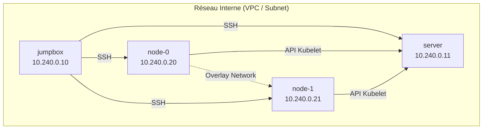

# High Level Design (HLD) : Kubernetes The Hard Way Multi-Cloud

**Version :** 1.0.0
**Auteur :** Zidane Djamal, Architecte technique senior, spécialisé en transformation Cloud Native, Kubernetes/OpenShift, modernisation de plateformes critiques, standardisation multi-environnements et industrialisation progressive.

---

## 1. Contexte

Le déploiement et la gestion de clusters Kubernetes sont aujourd'hui largement facilités par les offres managées des fournisseurs Cloud (GKE, EKS, AKS, etc.) ou par des outils d'installation automatisés (kubeadm, kubespray, OpenShift Installer). Si ces solutions sont indispensables pour opérer à l'échelle en production, elles créent une abstraction forte qui masque la complexité interne de la plateforme.

Pour les architectes, les Tech Leads et les ingénieurs plateforme, cette abstraction devient un frein lorsqu'il s'agit de diagnostiquer des incidents complexes, d'optimiser les performances, ou de concevoir des architectures sur mesure (edge computing, environnements déconnectés, contraintes réglementaires strictes).

Le projet **Kubernetes The Hard Way Multi-Cloud** s'inscrit dans ce contexte en proposant une démarche d'ingénierie inversée et de construction manuelle, étape par étape, d'un cluster Kubernetes fonctionnel. L'originalité de ce projet réside dans son approche multi-environnements (On-Premises, AWS, Azure, GCP, IBM Cloud) et sa structuration industrielle, traitant ce laboratoire comme un véritable actif d'architecture.

---

## 2. Objectifs

Ce document de High Level Design (HLD) a pour vocation de définir les fondations architecturales du projet. Les objectifs principaux sont les suivants :

- **Standardisation de l'apprentissage :** Fournir un cadre de référence commun pour comprendre l'architecture interne de Kubernetes (Control Plane, Data Plane, PKI, etcd).
- **Agnosticité de l'infrastructure :** Démontrer que la logique interne de Kubernetes reste identique quel que soit le fournisseur d'infrastructure sous-jacent.
- **Séparation des préoccupations (SoC) :** Isoler clairement le code et la configuration liés au "socle Kubernetes" (le Core) de ceux liés au provisionnement de l'infrastructure (les Providers).
- **Reproductibilité et Preuve :** Garantir que chaque étape peut être rejouée de manière déterministe et que le résultat est vérifiable via des preuves d'exécution.
- **Trajectoire d'industrialisation :** Poser les bases d'une évolution future vers l'automatisation complète (Ansible, Terraform, GitOps) tout en conservant la maîtrise des fondamentaux.

---

## 3. Périmètre (Scope)

Le périmètre de la version initiale (V1) couvre le déploiement manuel d'un cluster Kubernetes fonctionnel. Il inclut spécifiquement :

- Le provisionnement minimal de l'infrastructure (Compute, Réseau basique, Règles de pare-feu essentielles).
- La préparation système des nœuds (OS Linux, pré-requis kernel, installation des binaires).
- La génération manuelle et la distribution de l'infrastructure à clé publique (PKI) complète (CA, certificats serveurs, certificats clients).
- La création des fichiers `kubeconfig` pour l'authentification des composants.
- La configuration du chiffrement des secrets au repos.
- Le déploiement et la configuration d'un cluster `etcd` (mono-nœud pour la V1).
- L'initialisation du Control Plane (kube-apiserver, kube-controller-manager, kube-scheduler).
- Le bootstrapping des Workers (kubelet, kube-proxy, containerd).
- L'exécution de tests de validation (Smoke Tests) pour confirmer le bon fonctionnement.
- Les procédures de nettoyage (Cleanup) pour détruire l'infrastructure.
- La production d'une documentation détaillée (HLD, LLD) et la collecte de preuves d'exécution.

---

## 4. Hors Périmètre (Out of Scope)

Pour maintenir la lisibilité et l'objectif pédagogique de la V1, les éléments suivants sont explicitement exclus du périmètre actuel :

- La Haute Disponibilité (HA) généralisée (Control Plane multi-nœuds, Load Balancers complexes, etcd en cluster).
- Le déploiement d'un Service Mesh (Istio, Linkerd, Cilium avancé).
- L'observabilité complète (Prometheus, Grafana, ELK/EFK, Jaeger).
- L'implémentation d'une chaîne GitOps (ArgoCD, Flux).
- Le hardening de sécurité de niveau production (CIS Benchmarks stricts, AppArmor/SELinux avancés, NetworkPolicies restrictives).
- L'intégration d'Identity and Access Management (IAM) ou de Single Sign-On (SSO) avancés (OIDC, LDAP).
- La configuration de solutions de stockage persistantes complexes (CSI complet avec provisionnement dynamique multi-cloud).
- Toute garantie ou promesse de fournir un environnement "Production Ready".

---

## 5. Principes d'Architecture

L'architecture du projet repose sur les principes directeurs suivants :

1. **Mutualisation du socle commun :** La logique d'installation de Kubernetes (génération des certificats, configuration des services systemd, etc.) doit être écrite une seule fois dans le répertoire `core/` et être réutilisable à l'identique pour tous les environnements.
2. **Isolation des écarts d'infrastructure (Overlays) :** Toute spécificité liée à un Cloud Provider (création de VPC, instanciation de VM, configuration de Security Groups) doit être confinée dans son répertoire dédié `providers/<nom_provider>/`.
3. **Topologie logique immuable :** Le nombre de nœuds, leurs rôles et leurs noms logiques doivent rester strictement identiques d'un environnement à l'autre pour garantir la validité des scripts du socle commun.
4. **Documentation as Code :** L'architecture et les décisions techniques doivent être documentées au plus près du code, versionnées, et suivre une structure standardisée (HLD, LLD, ADR).
5. **Preuve par l'exécution :** Une architecture n'est valide que si elle est prouvée. La collecte d'évidences (logs, retours de commandes) est une exigence fondamentale.

---

## 6. Architecture Logique Cible

La topologie logique est volontairement simple et standardisée. Elle se compose de quatre nœuds distincts :

| Rôle Logique | Hostname | Fonction Principale | Composants Installés |
| :--- | :--- | :--- | :--- |
| **Bastion / Outils** | `jumpbox` | Point d'entrée sécurisé, génération de la PKI, distribution des artefacts. | `cfssl`, `kubectl`, clés SSH |
| **Control Plane** | `server` | Gestion de l'état du cluster, API Kubernetes. | `kube-apiserver`, `kube-controller-manager`, `kube-scheduler`, `etcd` |
| **Worker Node 0** | `node-0` | Exécution des charges de travail (Pods). | `kubelet`, `kube-proxy`, `containerd`, `runc`, `cni-plugins` |
| **Worker Node 1** | `node-1` | Exécution des charges de travail (Pods). | `kubelet`, `kube-proxy`, `containerd`, `runc`, `cni-plugins` |

### Diagramme de Topologie Logique

*(Note : Les adresses IP sont données à titre indicatif et peuvent varier selon le provider, mais le plan d'adressage interne visera toujours le bloc `10.240.0.0/24` pour l'infrastructure).*

---

## 7. Couches d'Architecture

L'architecture se décompose en trois couches distinctes :

### 7.1. Couche Infrastructure (IaaS)
Gérée par les modules Terraform spécifiques à chaque provider. Elle est responsable de :
- La création du réseau virtuel (VPC, VNet).
- La définition des sous-réseaux (Subnets).
- La configuration des règles de filtrage (Security Groups, Firewall Rules) pour autoriser SSH (22), l'API Kubernetes (6443), et le trafic inter-nœuds.
- L'instanciation des machines virtuelles (Compute) avec un OS Linux standard (ex: Ubuntu 22.04 LTS).
- L'allocation d'adresses IP publiques (si nécessaire pour l'accès externe à l'API) et privées.

### 7.2. Couche Configuration (Inventory & Scripts)
Gérée par les scripts bash du socle `core/`. Elle assure :
- La création de l'inventaire (`inventory.env`) faisant le pont entre l'infrastructure dynamique et les scripts statiques.
- La génération de la PKI complète.
- La création des configurations Kubernetes (`kubeconfig`, fichiers de chiffrement).
- La distribution sécurisée de ces artefacts depuis la `jumpbox` vers les nœuds cibles via `scp`.

### 7.3. Couche Kubernetes (Control Plane & Data Plane)
Le déploiement effectif des binaires et la configuration des services `systemd`.
- **Control Plane :** Configuration de l'API Server pour exposer l'interface, du Controller Manager pour les boucles de contrôle, du Scheduler pour le placement des pods, et de `etcd` pour le stockage d'état.
- **Data Plane :** Configuration de `containerd` comme runtime CRI, de `kubelet` pour la gestion locale des conteneurs, et de `kube-proxy` (en mode iptables ou ipvs) pour le routage des services. Configuration du réseau CNI (Container Network Interface).

---

## 8. Stratégie Multi-Cloud

La stratégie multi-cloud repose sur l'abstraction fournie par le concept d'inventaire.

1. **Phase Provider :** L'utilisateur choisit un provider (ex: AWS). Il exécute le code Terraform correspondant dans `terraform/aws/`.
2. **Phase Génération d'Inventaire :** Le code Terraform (ou un script post-provisioning) génère un fichier standardisé `inventories/aws/inventory.env`. Ce fichier contient les correspondances entre les noms logiques (`server`, `node-0`) et les adresses IP réelles allouées par le cloud provider.
3. **Phase Core :** L'utilisateur exécute les scripts du répertoire `scripts/core/`. Ces scripts sourcent le fichier `inventory.env`. Ainsi, la logique de déploiement Kubernetes ignore totalement sur quel cloud elle s'exécute ; elle ne connaît que des adresses IP et des clés SSH.

---

## 9. Hypothèses, Contraintes et Risques

### Hypothèses (Assumptions)
- L'utilisateur dispose d'un poste de travail local avec les outils de base installés (Git, Terraform, SSH client).
- L'utilisateur possède des comptes valides et suffisamment provisionnés sur les plateformes Cloud ciblées.
- Les OS des machines virtuelles provisionnées sont basés sur des distributions Linux compatibles Debian/Ubuntu (pour la standardisation des chemins et gestionnaires de paquets dans la V1).

### Contraintes (Constraints)
- Le déploiement doit être réalisable manuellement pour conserver l'aspect "Hard Way". L'automatisation complète de la phase Kubernetes est proscrite dans cette version.
- Les coûts d'infrastructure doivent être minimisés. Les instances choisies seront de petite taille, suffisantes pour un laboratoire mais inadaptées à une charge de production.

### Risques (Risks)
- **Évolution des APIs Cloud :** Les modules Terraform peuvent devenir obsolètes suite à des changements d'API des fournisseurs. *Mitigation : Figer les versions des providers Terraform et tester régulièrement.*
- **Dépréciation de composants Kubernetes :** Le projet se base sur une version spécifique de Kubernetes. Les versions futures pourraient introduire des changements bloquants (ex: remplacement de composants, changements de flags). *Mitigation : Documenter clairement la version de Kubernetes supportée et traiter les mises à jour majeures comme de nouvelles itérations du projet.*
- **Complexité de la PKI :** La gestion manuelle des certificats est sujette aux erreurs humaines (dates d'expiration, SANs incorrects). *Mitigation : Fournir des scripts de génération clairs et commentés dans le socle commun.*

---

## 10. Décisions d'Architecture (ADR Résumé)

| Sujet | Décision | Justification |
| :--- | :--- | :--- |
| **Container Runtime** | `containerd` | Standard de l'industrie, léger, supporté nativement par Kubernetes via CRI, suite à la dépréciation de Docker-shim. |
| **Network Plugin (CNI)** | Réseau de base (Bridge) / Calico | Pour la V1, une configuration de routage statique ou un plugin simple sera privilégié pour comprendre les flux, avant d'introduire des solutions plus complexes. |
| **Provisioning Infra** | Terraform | Outil standard, agnostique, permettant de gérer l'infrastructure as code de manière déclarative pour tous les providers ciblés. |
| **Gestion PKI** | `cfssl` (Cloudflare) | Outil robuste, largement utilisé dans l'écosystème Kubernetes pour la génération programmatique de certificats. |

---

## 11. Ordre de Réalisation

L'implémentation du projet suivra cet ordre logique :

1. **Fondations Documentaires :** Finalisation du HLD et des LLDs (Global + Providers).
2. **Développement Core (Scripts) :** Écriture des scripts de génération PKI, Kubeconfigs, et configuration des services (agnostiques).
3. **Implémentation Provider 1 (GCP) :** Développement du module Terraform GCP et validation de bout en bout avec le Core. C'est l'environnement historique du "Hard Way".
4. **Implémentation Provider 2 (AWS) :** Développement du module Terraform AWS, adaptation de l'inventaire, validation.
5. **Implémentation Providers 3, 4, 5 (Azure, IBM Cloud, On-Prem) :** Développements itératifs des autres environnements.
6. **Consolidation :** Révision du code, ajout des tests de validation (Smoke Tests) et finalisation des preuves d'exécution.

---

## 12. Évolutions Futures

Bien que hors périmètre de la V1, l'architecture est conçue pour accueillir les évolutions suivantes :

- **Automatisation (V2) :** Remplacement de l'exécution manuelle des scripts Core par des playbooks Ansible, transformant le laboratoire en un véritable outil de déploiement automatisé.
- **Haute Disponibilité (V3) :** Ajout de multiples nœuds Control Plane derrière un Load Balancer, et configuration d'un cluster `etcd` distribué.
- **Intégration Continue (CI) :** Mise en place de GitHub Actions pour valider automatiquement le code Terraform et exécuter des tests de déploiement e2e réguliers.

---

## 13. Conclusion

Le projet **Kubernetes The Hard Way Multi-Cloud** est conçu comme un outil d'excellence technique. En imposant une séparation stricte entre l'infrastructure sous-jacente et la logique interne de Kubernetes, il permet de démystifier le fonctionnement du cluster tout en fournissant une base solide, documentée et évolutive pour des expérimentations architecturales avancées.

---
**Signé :**
*Zidane Djamal*
*Architecte technique senior*
