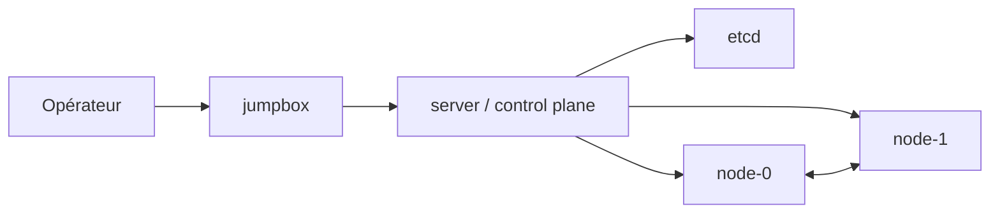
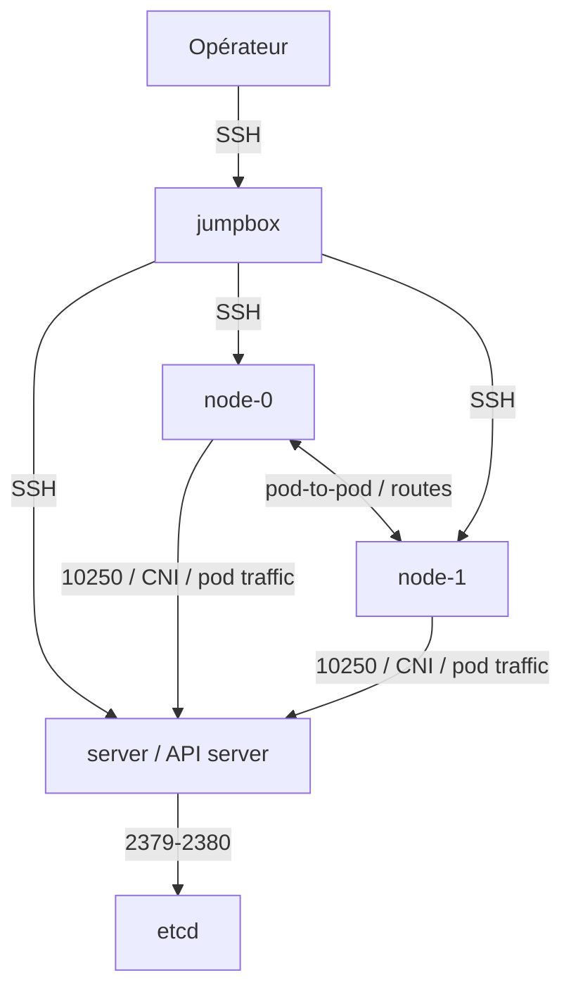
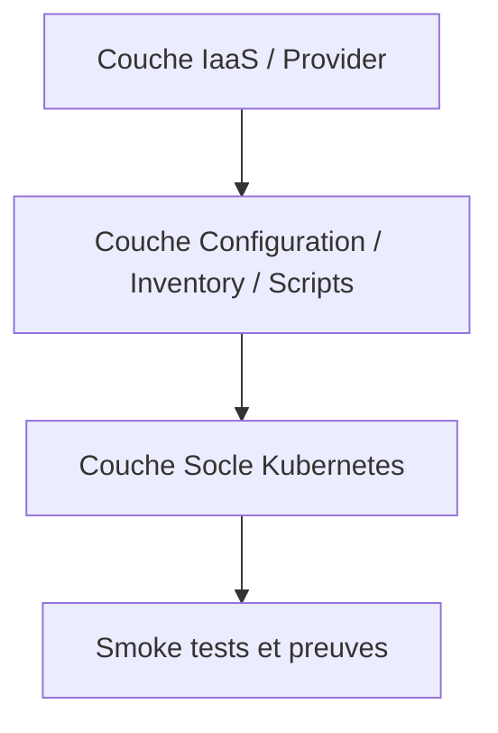
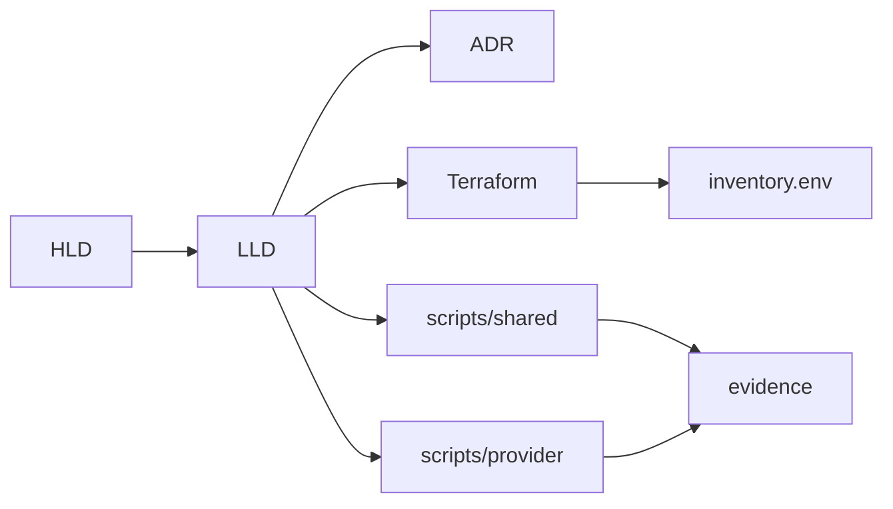

# HLD — Kubernetes The Hard Way Multi-Cloud

**Titre** : High Level Design — `kubernetes-the-hard-way-multicloud`  
**Version** : v3.0  
**Auteur** : **Zidane Djamal**  
**Rôle** : Architecte technique senior, spécialisé en transformation Cloud Native, Kubernetes/OpenShift, modernisation de plateformes critiques, standardisation multi-environnements et industrialisation progressive  
**Statut** : Draft consolidé  
**Périmètre** : On-Prem, AWS, Azure, GCP, IBM Cloud

---

## 1. Contexte

Le projet `kubernetes-the-hard-way-multicloud` vise à construire un dépôt unique, cohérent et réutilisable permettant d’exécuter une approche **Kubernetes The Hard Way** sur plusieurs cibles d’infrastructure :

- on-prem,
- AWS,
- Azure,
- GCP,
- IBM Cloud.

L’objectif n’est pas de fournir une plateforme Kubernetes managée ni une architecture de production complète. Le projet vise à :

- comprendre les mécanismes internes de Kubernetes,
- comparer les différences d’implémentation entre fournisseurs,
- standardiser un socle commun,
- structurer un actif d’architecture crédible,
- servir de base pédagogique et d’industrialisation progressive.

Le dépôt doit ressembler au travail d’un architecte technique senior :

**cadrage → HLD → LLD → ADR → structure du dépôt → provisionnement → exécution → preuves**.

---

## 2. Objectifs

### 2.1 Objectifs fonctionnels

Le dépôt doit permettre de :

- provisionner une infrastructure minimale sur plusieurs providers ;
- préparer une topologie pédagogique standard ;
- déployer un cluster Kubernetes « hard way » sans dépendance à un service managé ;
- générer des inventaires d’exécution ;
- fournir une documentation complète HLD / LLD / ADR / guides ;
- produire des preuves d’exécution exploitables.

### 2.2 Objectifs d’architecture

Le dépôt doit démontrer et appliquer le principe directeur suivant :

> **Mutualiser le socle Kubernetes commun et isoler les écarts d’infrastructure dans des overlays provider.**

### 2.3 Objectifs pédagogiques

Le dépôt doit rendre visibles et compréhensibles :

- la PKI Kubernetes,
- les kubeconfigs,
- etcd,
- le control plane,
- les workers,
- les flux réseau majeurs,
- la séparation entre provisionnement et bootstrap Kubernetes.

---

## 3. Audience et parties prenantes

Ce document HLD est destiné à :

- **architectes techniques** : vision globale, principes, décisions structurantes ;
- **tech leads / platform engineers** : trajectoire d’implémentation et découpage du dépôt ;
- **ingénieurs DevOps / Cloud** : compréhension des couches et des responsabilités ;
- **reviewers GitHub / recruteurs techniques** : crédibilité du dépôt et lisibilité d’ensemble ;
- **formateurs / apprenants avancés** : support d’apprentissage structuré ;
- **lecteurs internes ou externes** : compréhension rapide du périmètre, des limites et des objectifs.

Le niveau de détail du HLD reste volontairement supérieur à un README, mais inférieur à un guide d’implémentation détaillé.

---

## 4. Références et documents liés

Le HLD s’inscrit dans un ensemble documentaire cohérent. Les documents liés sont les suivants :

- `README.md` : vision synthétique du dépôt et parcours de lecture ;
- `docs/lld/LLD-global.md` : déclinaison technique détaillée de la structure du dépôt ;
- `docs/lld/<provider>.md` : détail technique par provider ;
- `docs/adr/` : décisions d’architecture ciblées et arbitrages ;
- `docs/core/` : description du socle Kubernetes ;
- `docs/providers/<provider>/README.md` : mode d’emploi par overlay ;
- `terraform/<provider>/` : provisionnement de l’infrastructure ;
- `scripts/shared/` et `scripts/<provider>/` : orchestration et automatisation ;
- `inventories/` : fichiers d’exemple et inventaires d’exécution ;
- `evidence/` : preuves d’exécution et validations.

---

## 5. Périmètre

### 5.1 Inclus dans la V1

La V1 couvre :

- provisionnement minimal de l’infrastructure ;
- préparation système de base ;
- gestion de la PKI ;
- génération des kubeconfigs ;
- chiffrement des secrets ;
- déploiement d’etcd ;
- déploiement du control plane ;
- bootstrap des workers ;
- smoke tests ;
- cleanup ;
- documentation HLD / LLD / ADR / core / provider ;
- preuves d’exécution.

### 5.2 Hors périmètre de la V1

Sont exclus de la V1 :

- haute disponibilité généralisée multi-control-plane ;
- service mesh ;
- observabilité complète ;
- GitOps complet ;
- hardening production complet ;
- CSI / stockage avancé ;
- IAM / SSO avancé ;
- performance tuning avancé ;
- support production ;
- promesse « enterprise-ready ».

---

## 6. Exigences non fonctionnelles

Les exigences non fonctionnelles structurantes de la V1 sont les suivantes.

### 6.1 Reproductibilité

Le dépôt doit permettre de rejouer le provisioning et les étapes du socle Kubernetes de façon contrôlée, avec une structure stable et documentée.

### 6.2 Portabilité multi-cloud

Le design doit rendre possible l’exécution du même socle logique sur plusieurs providers, en limitant les divergences au strict nécessaire.

### 6.3 Simplicité maîtrisée

La V1 doit rester lisible et compréhensible. Le dépôt ne doit pas sacrifier la pédagogie à une automatisation excessive.

### 6.4 Traçabilité

Chaque étape importante doit pouvoir être reliée à :

- une décision d’architecture,
- un document LLD,
- un fichier Terraform ou script,
- une preuve d’exécution.

### 6.5 Maintenabilité

Le dépôt doit être structuré pour limiter la duplication et faciliter les évolutions futures.

### 6.6 Testabilité

Le design doit permettre des validations simples, explicites et répétables.

### 6.7 Sécurité minimale

Même en contexte lab, le projet doit adopter une posture de sécurité minimale cohérente.

### 6.8 Coût maîtrisé

Le sizing et l’architecture V1 doivent rester compatibles avec un usage de laboratoire à coût limité.

---

## 7. Standards, conventions et dépendances minimales

### 7.1 Standards et conventions

Le projet applique les conventions suivantes :

- séparation nette entre documentation, provisionnement, scripts et inventaires ;
- un provider = un sous-répertoire cohérent dans `docs/providers/`, `terraform/`, `scripts/` et `inventories/` ;
- pas de secret, clé privée ou certificat sensible dans Git ;
- preuves d’exécution stockées hors logique applicative dans `evidence/` ;
- structure de dépôt orientée lisibilité et relecture ;
- nomenclature stable des nœuds : `jumpbox`, `server`, `node-0`, `node-1`.

### 7.2 Dépendances externes minimales

La V1 suppose la disponibilité minimale de :

- Terraform ;
- `kubectl` ;
- une CLI ou un accès au provider cloud concerné ;
- un client SSH ;
- un outil de génération PKI tel que `cfssl`, ou un équivalent ;
- un poste opérateur capable d’exécuter shell, Terraform et commandes Kubernetes.

---

## 8. Baseline de versions cibles

La V1 doit être lue avec une baseline technique claire, même si les versions peuvent évoluer au fil des révisions du dépôt.

### 8.1 Baseline cible

- **Kubernetes** : version stable récente, alignée sur le dépôt à la date de travail ;
- **Terraform** : version moderne compatible avec les providers utilisés ;
- **OS de référence** : distribution Linux récente et homogène sur les nœuds ;
- **runtime conteneur** : `containerd` ;
- **outil PKI** : `cfssl` ou équivalent ;
- **shell d’orchestration** : bash.

### 8.2 Politique de lecture

Le HLD ne fige pas ici des patch versions contractuelles. Les versions effectives doivent être confirmées dans :

- les LLD,
- les inventaires d’exemple,
- les scripts,
- les fichiers Terraform,
- les preuves d’exécution.

---

## 9. Principes d’architecture

1. **Mutualisation du socle commun** : la logique commune du projet doit être centralisée et réutilisable à l’identique pour tous les environnements. Dans le dépôt réel, cela se traduit principalement par `docs/core/` pour la documentation du socle Kubernetes et `scripts/shared/` pour les scripts mutualisés.

2. **Isolation des écarts d’infrastructure** : les différences liées aux providers doivent être cantonnées aux zones prévues du dépôt : `docs/providers/<provider>/`, `terraform/<provider>/`, `scripts/<provider>/` et `inventories/<provider>/`.

3. **Topologie logique standard** : le même modèle logique doit être conservé pour tous les providers.

4. **Documentation d’abord** : le dépôt doit être piloté par ses documents d’architecture et non l’inverse.

5. **Industrialisation progressive** : la V1 privilégie la cohérence d’ensemble avant l’automatisation avancée.

6. **Pas de promesse production** : le projet reste un laboratoire expert et un actif d’architecture, pas une plateforme prête à l’exploitation en production.

---

## 10. Architecture logique cible

La topologie logique de référence de la V1 est la suivante :

- **1 jumpbox** : point d’entrée opérateur / administration ;
- **1 server** : nœud control plane ;
- **2 workers** : `node-0` et `node-1`.

### 10.1 Nommage standard

- `jumpbox`
- `server`
- `node-0`
- `node-1`

### 10.2 Intention

Cette topologie fournit un compromis entre :

- lisibilité pédagogique,
- coût raisonnable,
- simplicité d’exécution,
- suffisance technique pour comprendre les flux majeurs.

### 10.3 Schéma logique cible

---

## 11. Vue réseau de haut niveau

La vue réseau V1 doit rester simple, mais explicite les principaux flux.

### 11.1 Flux majeurs

- accès opérateur vers `jumpbox` en SSH ;
- accès `jumpbox` vers `server` et `workers` en SSH ;
- communications control plane ↔ etcd ;
- communications kubelet ↔ API server ;
- communications inter-nœuds ;
- exposition éventuelle de l’API server selon le provider et le design retenu.

### 11.2 Schéma des flux majeurs

### 11.3 Positionnement HLD

Le HLD ne descend pas au niveau d’une matrice exhaustive de ports. Les détails précis relèvent des LLD provider et des règles de sécurité implémentées dans Terraform.

---

## 12. Couches d’architecture

L’architecture du dépôt repose sur trois couches principales.

### 12.1 Couche IaaS / Provider

Cette couche couvre :

- réseau,
- sous-réseaux,
- règles de sécurité,
- VM / instances,
- IP publiques ou privées,
- routes spécifiques.

Elle est portée par les modules Terraform de `terraform/<provider>/` et les scripts de provisioning / cleanup de `scripts/<provider>/`.

### 12.2 Couche Configuration (Inventory & Scripts)

Cette couche est portée par les scripts mutualisés du répertoire `scripts/shared/`, complétés par les scripts spécifiques de chaque provider dans `scripts/<provider>/`. Elle assure :

- la préparation des variables d’exécution communes ;
- la production et l’exploitation de l’inventaire opérationnel ;
- l’articulation entre les informations issues du provisionnement et les étapes du socle Kubernetes.

Dans le dépôt réel, cette couche s’appuie sur deux types de fichiers :

- `lab.env.example` : fichier d’exemple statique fourni dans `inventories/<provider>/` ;
- `inventory.env` : fichier opérationnel généré par le provisionnement Terraform lorsqu’il est implémenté pour le provider concerné.

### 12.3 Couche Socle Kubernetes

Cette couche regroupe :

- PKI,
- kubeconfigs,
- chiffrement,
- etcd,
- control plane,
- workers,
- smoke tests.

Elle est documentée dans `docs/core/` et s’appuie sur les scripts mutualisés ainsi que sur les paramètres de l’inventaire opérationnel.

### 12.4 Schéma des couches

---

## 13. Stratégie multi-cloud

### 13.1 GCP

Provider de référence pédagogique et point d’entrée naturel pour valider le design.

### 13.2 AWS

Overlay orienté VPC, subnet, routing, security groups et EC2.

### 13.3 Azure

Overlay orienté VNet, subnet, NSG, VM et IP publiques.

### 13.4 IBM Cloud

Overlay orienté VPC, subnet, VSI et règles réseau.

### 13.5 On-Prem

Overlay reposant sur un inventaire maîtrisé, des VM ou machines physiques, et un réseau privé contrôlé. La V1 ne comporte pas de module Terraform on-prem dédié.

### 13.6 Séquence d’exécution type

1. préparation des variables provider ;
2. provisioning de l’infrastructure ;
3. génération de l’inventaire opérationnel ;
4. exécution du socle Kubernetes ;
5. validations ;
6. archivage des preuves ;
7. cleanup.

---

## 14. Sécurité minimale et modèle de confiance

La V1 n’intègre pas de hardening avancé, mais elle doit respecter une baseline de sécurité minimale.

### 14.1 Principes

- accès SSH restreint autant que possible ;
- exposition publique limitée aux besoins du lab ;
- séparation claire entre documentation d’exemple et paramètres opérationnels ;
- stockage contrôlé des clés et certificats ;
- posture explicite : **lab sécurisé minimalement, non production**.

### 14.2 Baseline attendue

- `jumpbox` privilégiée comme point d’administration ;
- exposition de l’API server explicitée selon le provider ;
- règles de sécurité documentées dans les LLD provider ;
- certificats et clés hors dépôt Git ;
- cleanup obligatoire après usage lorsque les ressources sont payantes.

### 14.3 Limites assumées

Sont hors périmètre V1 :

- IAM avancé,
- SSO,
- vault / secret manager complet,
- hardening CIS,
- segmentation réseau avancée,
- bastioning renforcé universel.

---

## 15. Hypothèses, contraintes et risques

### 15.1 Hypothèses

- usage de VM Linux homogènes ;
- disponibilité des CLI providers et de Terraform ;
- accès à une clé SSH valide ;
- connectivité réseau suffisante entre les nœuds ;
- exécution par un opérateur ayant des bases Linux / Cloud / Terraform.

### 15.2 Contraintes

- architecture volontairement non managée ;
- coût à contenir ;
- cohérence documentaire prioritaire ;
- portabilité multi-cloud sans sur-ingénierie ;
- temps d’exécution raisonnable ;
- lisibilité GitHub impérative.

### 15.3 Risques principaux

- dérive entre documentation et implémentation ;
- divergences trop fortes entre providers ;
- sur-automatisation qui masque la pédagogie ;
- exposition réseau trop large en V1 ;
- évolution rapide des versions Kubernetes / Terraform / OS.

---

## 16. Coûts, capacité et hypothèses FinOps

### 16.1 Hypothèse de capacité V1

La V1 vise un laboratoire léger :

- 4 machines au total ;
- 1 control plane simple ;
- 2 workers ;
- aucune exigence de charge réelle ;
- aucune promesse de performance.

### 16.2 Postes de coût majeurs

Les coûts principaux proviennent de :

- machines virtuelles,
- IP publiques statiques,
- trafic sortant éventuel,
- stockage attaché,
- durée de vie des ressources non nettoyées.

### 16.3 Garde-fous FinOps

- tailles d’instances modestes en V1 ;
- topologie minimale ;
- cleanup systématique ;
- documentation explicite du caractère lab ;
- extension future des tailles de nœuds uniquement si justifiée.

### 16.4 Limites de lecture coût

Le HLD ne fournit pas de benchmark financier précis. Les coûts réels dépendront :

- du provider,
- de la région,
- de la durée de vie des ressources,
- du modèle de facturation,
- de l’exposition publique retenue.

---

## 17. Décisions d’architecture

### 17.1 Décisions retenues

- dépôt unique multi-cloud ;
- topologie standard unique ;
- séparation nette entre socle commun et overlays provider ;
- V1 centrée sur la pédagogie et la cohérence ;
- Terraform pour le provisioning des clouds publics ;
- documentation d’architecture comme axe directeur.

### 17.2 Alternatives écartées

#### a. Cluster managé
Écarté pour préserver l’apprentissage des composants internes de Kubernetes.

#### b. `kubeadm`
Écarté en V1 pour éviter d’abstraire une partie importante des mécanismes ciblés par l’apprentissage.

#### c. `k3s`
Écarté car trop éloigné de l’objectif de compréhension du control plane standard.

#### d. Docker runtime historique
Écarté au profit de `containerd`, plus cohérent avec les pratiques modernes Kubernetes.

#### e. etcd distribué complexe en V1
Écarté pour limiter le coût, la complexité et préserver la lisibilité pédagogique.

---

## 18. Critères de succès / acceptation V1

La V1 est considérée comme réussie si les critères suivants sont satisfaits.

### 18.1 Critères techniques

- l’infrastructure est provisionnée sans erreur bloquante ;
- l’inventaire opérationnel est généré ou exploitable ;
- les certificats nécessaires sont produits correctement ;
- le control plane démarre ;
- les workers rejoignent le cluster ;
- `kubectl get nodes` renvoie les nœuds attendus ;
- un pod de test peut être exécuté ;
- les smoke tests sont concluants.

### 18.2 Critères documentaires

- HLD, LLD et ADR sont cohérents ;
- la structure du dépôt est lisible ;
- les étapes principales sont documentées ;
- les écarts provider sont identifiés clairement.

### 18.3 Critères opérationnels

- les étapes sont rejouables sur au moins un provider ;
- les preuves d’exécution sont archivées ;
- les ressources peuvent être détruites proprement via cleanup.

---

## 19. Limites connues de la V1

Les limites connues de la V1 sont les suivantes :

- absence de haute disponibilité généralisée ;
- résilience limitée du control plane ;
- posture sécurité non adaptée à une production ;
- réseau volontairement simplifié ;
- couverture on-prem partielle ;
- benchmark de coût non fourni ;
- dépendance à une revue humaine pour garantir l’alignement entre documentation et implémentation.

Ces limites sont assumées et cohérentes avec la vocation pédagogique et progressive du projet.

---

## 20. Modèle d’exploitation minimal

Le modèle opératoire V1 est le suivant :

- l’opérateur travaille depuis son poste et/ou depuis `jumpbox` selon le provider ;
- le provisioning est lancé via `terraform/<provider>/` et `scripts/<provider>/` ;
- les fichiers d’inventaire servent de pivot d’exécution ;
- le socle Kubernetes est déroulé selon les chapitres de `docs/core/` ;
- les sorties utiles sont conservées dans `evidence/` ;
- le cleanup est exécuté en fin de session ou à la fin du lab.

---

## 21. Traçabilité documentaire et opérationnelle

Le projet suit la logique de traçabilité suivante :

- **HLD** : vision, principes, décisions structurantes ;
- **LLD** : déclinaison technique détaillée par couche et provider ;
- **ADR** : décisions ciblées et arbitrages ;
- **Terraform** : provisionnement de l’infrastructure ;
- **scripts/shared/** : mécanismes mutualisés ;
- **scripts/<provider>/** : orchestration spécifique ;
- **inventories/** : exemples et inventaires d’exécution ;
- **evidence/** : preuves et validations.

### 21.1 Schéma de traçabilité

---

## 22. Critères de passage en V2

La V2 du dépôt pourra être ouverte lorsque les conditions suivantes seront réunies :

- HLD, LLD et dépôt réel sont alignés ;
- au moins un provider est exécutable de bout en bout ;
- les scripts partagés sont stabilisés ;
- les fichiers d’exemple et inventaires sont cohérents ;
- les preuves d’exécution sont exploitables.

### 22.1 Priorités probables de la V2

- renforcement de la cohérence doc ↔ code ;
- validation CI minimale ;
- meilleure couverture on-prem ;
- extension sécurité ;
- observabilité de base ;
- rationalisation des overlays provider ;
- matrice de versions et compatibilité détaillée.

---

## 23. Ordre de réalisation recommandé

1. stabiliser le HLD ;
2. stabiliser le LLD global ;
3. stabiliser le provider de référence ;
4. aligner documentation et dépôt réel ;
5. renforcer les scripts mutualisés ;
6. fiabiliser les overlays provider ;
7. ajouter les validations systématiques ;
8. enrichir les preuves d’exécution ;
9. préparer la V2.

---

## 24. Évolutions futures

Les évolutions possibles après stabilisation de la V1 sont :

- HA multi-control-plane ;
- durcissement sécurité ;
- intégration d’observabilité ;
- GitOps / Argo CD ;
- pipelines CI de validation ;
- support élargi on-prem ;
- matrice de compatibilité détaillée ;
- benchmark de coûts par provider ;
- version orientée OpenShift.

---

## 25. Glossaire minimal

- **jumpbox** : hôte d’administration utilisé comme point d’entrée opérateur ;
- **overlay provider** : partie du dépôt spécifique à un cloud ou à on-prem ;
- **socle Kubernetes** : ensemble des étapes communes liées au cluster lui-même ;
- **inventory.env** : inventaire opérationnel généré ou exploité à l’exécution ;
- **lab.env.example** : exemple statique de variables et paramètres ;
- **smoke tests** : tests rapides permettant de valider le fonctionnement minimal ;
- **evidence** : preuves d’exécution, sorties, captures et validations archivées.

---

## 26. Conclusion

Le projet `kubernetes-the-hard-way-multicloud` constitue un **actif d’architecture multi-cloud** centré sur la compréhension des mécanismes internes de Kubernetes, la comparabilité entre providers et la structuration d’un dépôt sérieux, lisible et réutilisable.

La valeur de la V1 repose sur trois piliers :

- **cohérence documentaire**,
- **mutualisation du socle**,
- **maîtrise explicite des écarts provider**.

Le HLD fournit la vision cible, les principes directeurs, les critères de réussite et les limites connues nécessaires pour guider le LLD, l’implémentation et les futures corrections du dépôt.

---

## 27. Signature du document

**Auteur** : Zidane Djamal  
**Rôle** : Architecte technique senior  
**Positionnement** : Architecte adapté à la mission, avec une approche orientée transformation Cloud Native, Kubernetes/OpenShift, standardisation multi-environnements, pédagogie avancée et industrialisation progressive.

