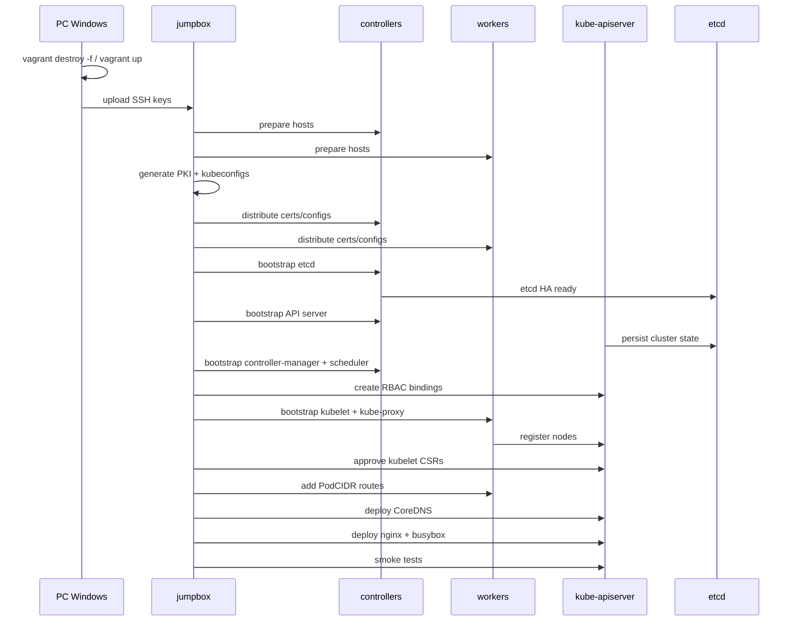
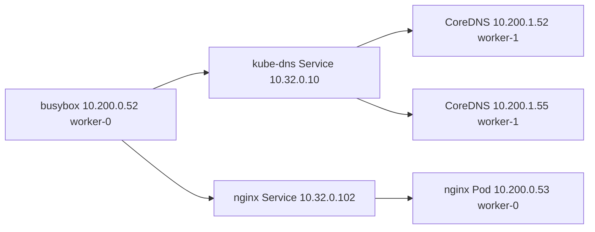

# Diagrammes Mermaid

## Topologie

```mermaid
flowchart TB
  PC[PC Windows Git Bash] --> VB[VirtualBox Host-Only Network 192.168.56.0/24]
  VB --> J[jumpbox 192.168.56.10]
  VB --> C0[controller-0 192.168.56.11]
  VB --> C1[controller-1 192.168.56.12]
  VB --> C2[controller-2 192.168.56.13]
  VB --> W0[worker-0 192.168.56.21 PodCIDR 10.200.0.0/24]
  VB --> W1[worker-1 192.168.56.22 PodCIDR 10.200.1.0/24]

  J --> C0
  J --> C1
  J --> C2
  J --> W0
  J --> W1

  W0 -. route 10.200.1.0/24 via 192.168.56.22 .-> W1
  W1 -. route 10.200.0.0/24 via 192.168.56.21 .-> W0
```

## Séquence de construction



## Flux DNS final


