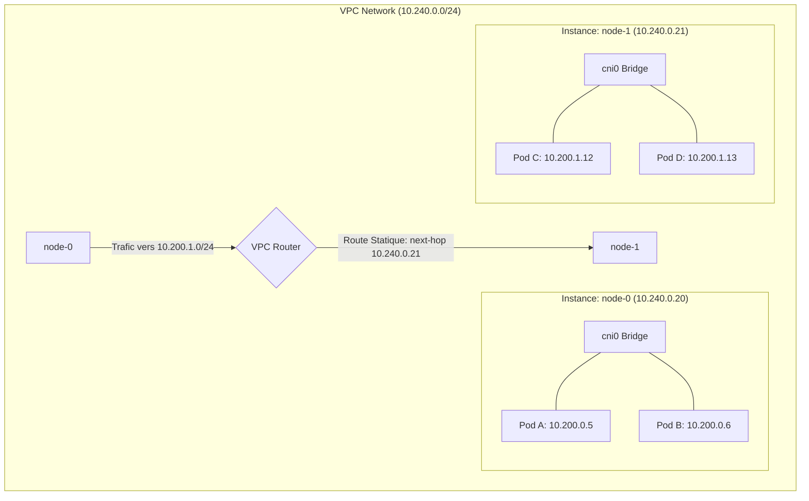

# Exemple d'Exécution : Topologie et Routage

Ce document illustre concrètement comment la topologie standard (ADR-002) se matérialise une fois déployée sur un fournisseur Cloud, en prenant **GCP** comme exemple.

## Mapping de la Topologie Standard vers GCP

| Nœud Standard | Rôle | Instance GCP | IP Privée | IP Publique (Exemple) | Pod CIDR Alloué |
| :--- | :--- | :--- | :--- | :--- | :--- |
| `jumpbox` | Bastion / Outils | `e2-micro` | `10.240.0.10` | `34.76.12.99` | *N/A* |
| `server` | Control Plane | `e2-standard-2` | `10.240.0.11` | `35.195.44.12` | *N/A* |
| `node-0` | Worker 0 | `e2-standard-2` | `10.240.0.20` | `34.77.100.5` | `10.200.0.0/24` |
| `node-1` | Worker 1 | `e2-standard-2` | `10.240.0.21` | `35.240.88.19` | `10.200.1.0/24` |

## Schéma de Routage (Pod-to-Pod Communication)

Le défi principal de "Kubernetes The Hard Way" est de comprendre comment un Pod sur `node-0` (ex: IP `10.200.0.5`) peut communiquer avec un Pod sur `node-1` (ex: IP `10.200.1.12`) sans utiliser de plugin réseau complexe (Overlay Network type VxLAN/Calico).

Nous utilisons le routage natif du Cloud Provider (VPC Routes).

### Explication du flux :
1. **Pod A** (`10.200.0.5`) veut parler à **Pod C** (`10.200.1.12`).
2. Le paquet quitte le namespace réseau de Pod A et arrive sur le bridge `cni0` de `node-0`.
3. La table de routage Linux de `node-0` ne connaît pas `10.200.1.0/24`, elle envoie donc le paquet à sa passerelle par défaut (le routeur du VPC GCP).
4. Le **Routeur VPC** consulte ses routes personnalisées (créées via Terraform). Il voit une route indiquant que la destination `10.200.1.0/24` est joignable via l'instance `node-1` (`10.240.0.21`).
5. Le paquet est délivré à l'interface réseau de `node-1`.
6. *(Crucial)* L'interface de `node-1` accepte le paquet car l'option `can_ip_forward = true` (ou `source_dest_check = false` sur AWS) est activée, même si l'IP de destination (`10.200.1.12`) n'est pas l'IP de la VM (`10.240.0.21`).
7. Le kernel Linux de `node-1` (avec `net.ipv4.ip_forward=1`) route le paquet vers son bridge local `cni0`, qui le délivre finalement au **Pod C**.
