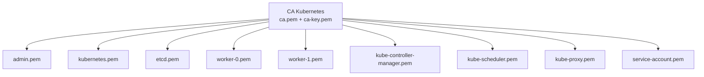
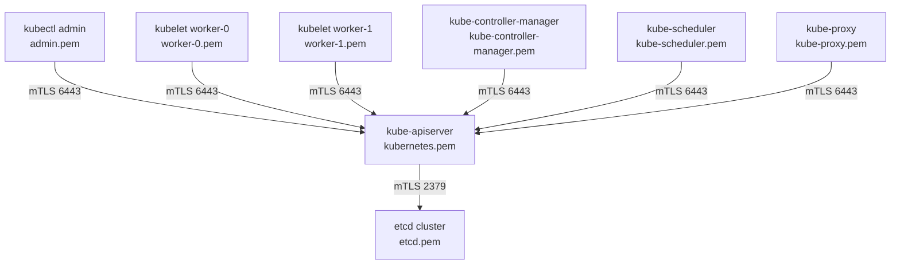
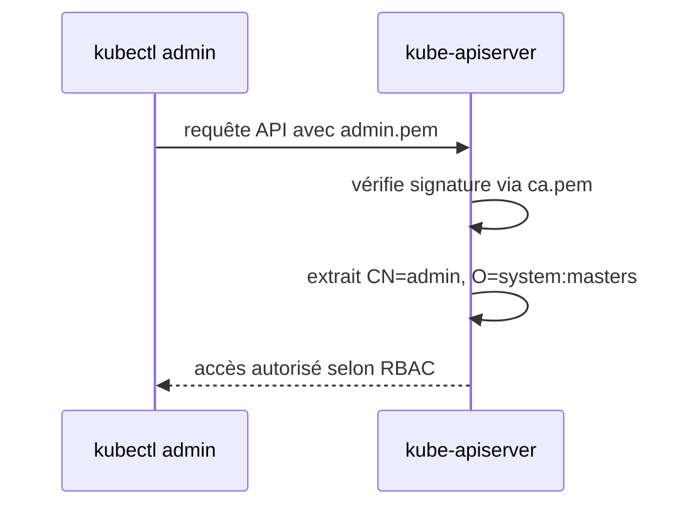
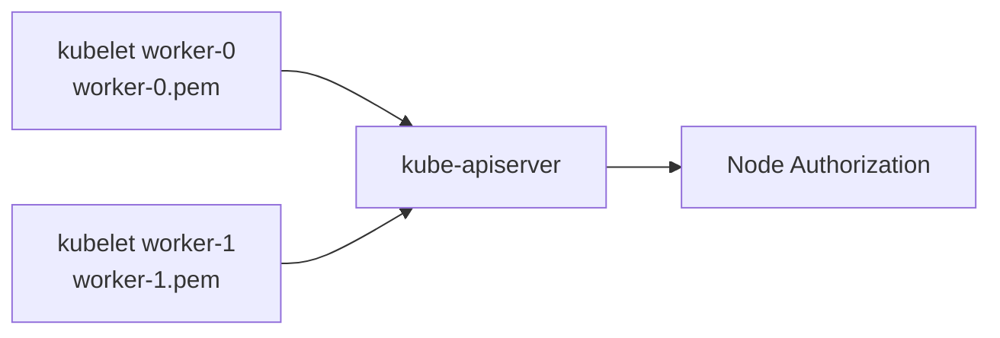
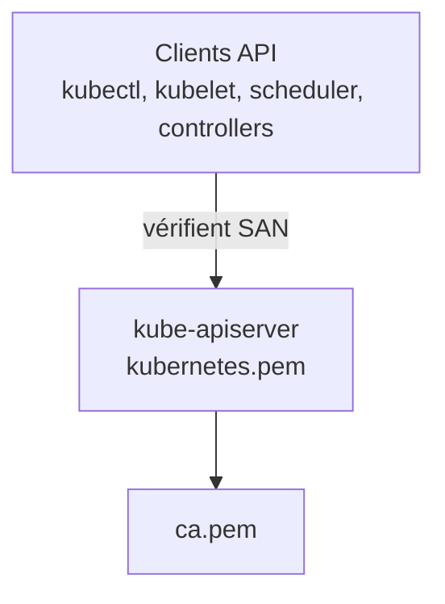
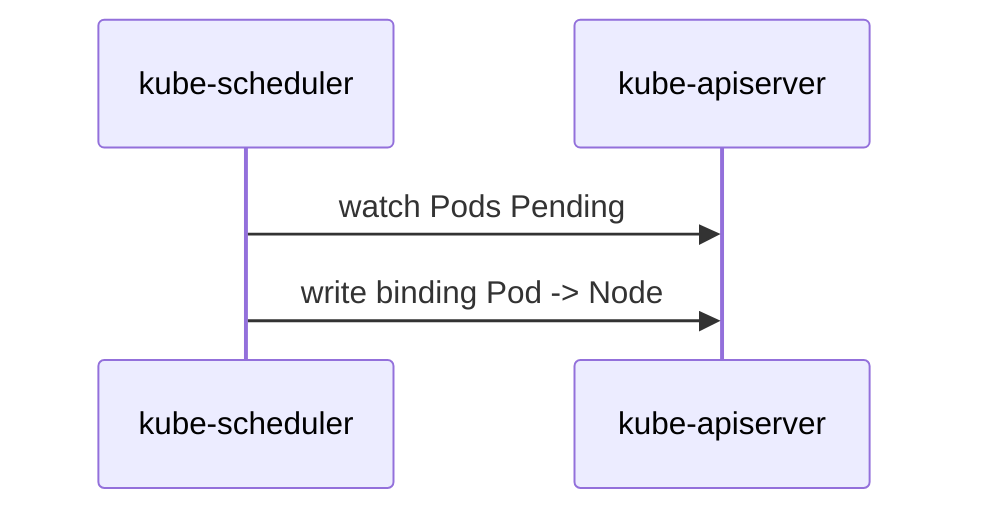
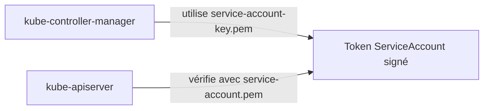
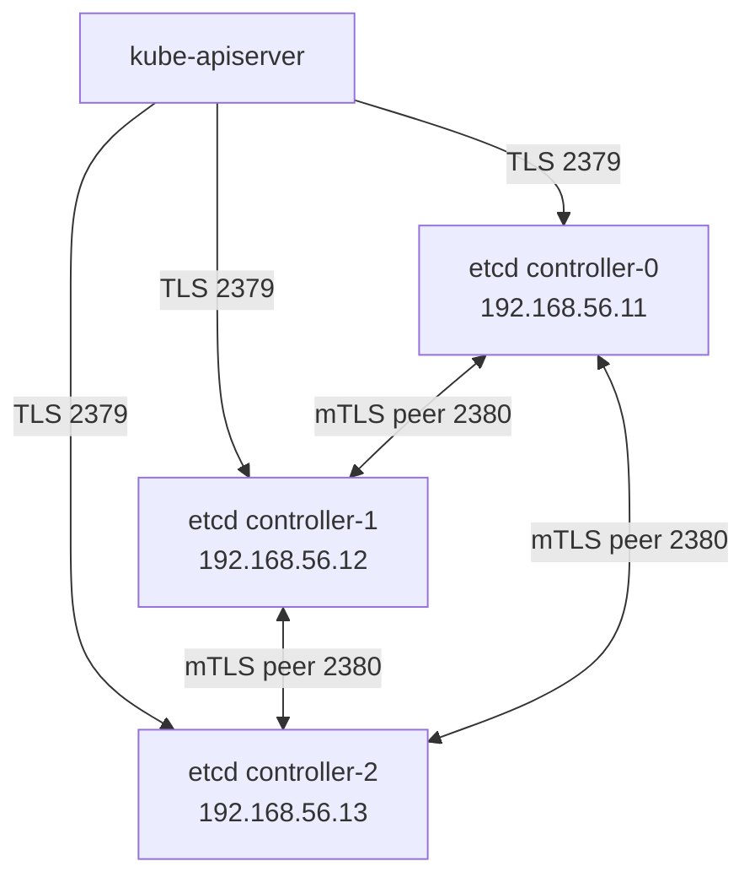
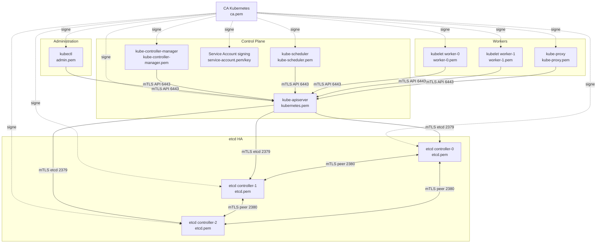
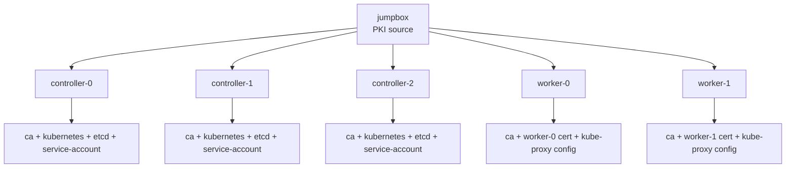

# Kubernetes Hard Way – PKI et Certificats
## Du niveau 0 à la vision architecte

## Objectif
Ce document explique la PKI Kubernetes générée dans notre lab Vagrant On-Prem, depuis les bases jusqu’à la lecture architecture/audit.

Nous avons généré :

```text
admin-key.pem
admin.pem
ca-key.pem
ca.pem
etcd-key.pem
etcd.pem
kube-controller-manager-key.pem
kube-controller-manager.pem
kube-proxy-key.pem
kube-proxy.pem
kubernetes-key.pem
kubernetes.pem
kube-scheduler-key.pem
kube-scheduler.pem
service-account-key.pem
service-account.pem
worker-0-key.pem
worker-0.pem
worker-1-key.pem
worker-1.pem
```

---

# 1. Comprendre la PKI depuis zéro

## 1.1 Problème à résoudre
Dans Kubernetes, beaucoup de composants doivent communiquer entre eux :

- `kubectl` parle à `kube-apiserver`
- `kubelet` parle à `kube-apiserver`
- `kube-apiserver` parle à `etcd`
- `kube-controller-manager` parle à `kube-apiserver`
- `kube-scheduler` parle à `kube-apiserver`
- `kube-proxy` parle à `kube-apiserver`

Le problème est double :

1. Comment être sûr que je parle au **bon serveur** ?
2. Comment le serveur sait-il **qui je suis** ?

La réponse : **TLS + certificats**.

---

## 1.2 TLS expliqué simplement
TLS permet :

- de chiffrer les échanges,
- de vérifier l’identité du serveur,
- parfois de vérifier l’identité du client.

Dans Kubernetes, on utilise souvent du **mTLS** : mutual TLS.

Cela veut dire :

```text
le client vérifie le serveur
ET
le serveur vérifie le client
```

---

## 1.3 Certificat et clé privée
Chaque identité importante possède généralement :

```text
certificat public : xxx.pem
clé privée        : xxx-key.pem
```

### Certificat public
Il peut être partagé. Il contient :
- le nom du sujet,
- l’organisation,
- les usages,
- les SAN,
- la signature de la CA.

### Clé privée
Elle ne doit jamais être exposée. Elle prouve que l’entité possède bien l’identité du certificat.

---

## 1.4 La CA
La CA signifie **Certificate Authority**.

Dans notre lab :

```text
ca.pem      = certificat public de la CA
ca-key.pem  = clé privée de la CA
```

La CA signe tous les autres certificats.

### Schéma


### Lecture simple
Si un certificat est signé par `ca-key.pem`, alors les composants qui font confiance à `ca.pem` peuvent accepter ce certificat.

---

# 2. Pourquoi Kubernetes a besoin d’autant de certificats ?

Kubernetes est une architecture distribuée.

Chaque composant important doit avoir une identité propre.

## 2.1 Principe

```text
un composant = une identité = un certificat
```

Ce principe permet :
- l’authentification,
- le RBAC,
- la traçabilité,
- l’isolation,
- l’audit.

---

## 2.2 Vue globale des échanges sécurisés



---

# 3. Les certificats générés dans notre lab

## 3.1 CA Kubernetes

### Fichiers
```text
ca.pem
ca-key.pem
```

### Rôle
C’est la racine de confiance du cluster.

### Où elle sera utilisée ?
- tous les composants clients utilisent `ca.pem` pour vérifier les certificats serveur,
- tous les certificats ont été signés par `ca-key.pem`.

### Point d’audit
`ca-key.pem` est ultra sensible. Si elle fuite, un attaquant peut signer de nouveaux certificats valides.

---

## 3.2 Certificat admin

### Fichiers
```text
admin.pem
admin-key.pem
```

### Identité
```text
CN = admin
O  = system:masters
```

### Rôle
Permet à l’administrateur d’utiliser `kubectl` avec des droits élevés.

### Pourquoi `system:masters` est important ?
Dans Kubernetes, le groupe `system:masters` est généralement considéré comme super-admin.

### Flux


### Point d’audit
Ne jamais distribuer `admin-key.pem` largement. C’est une clé d’administration totale.

---

## 3.3 Certificats kubelet workers

### Fichiers
```text
worker-0.pem
worker-0-key.pem
worker-1.pem
worker-1-key.pem
```

### Identités
```text
CN = system:node:worker-0
O  = system:nodes

CN = system:node:worker-1
O  = system:nodes
```

### Rôle
Chaque kubelet utilise son certificat pour s’authentifier auprès de l’API Server.

### Pourquoi le CN est spécial ?
Kubernetes attend souvent le format :

```text
system:node:<node-name>
```

Cela permet au mode d’autorisation `Node` d’identifier précisément le nœud.

### SAN validés
Pour `worker-0` :

```text
DNS:worker-0
IP:192.168.56.21
```

Pour `worker-1` :

```text
DNS:worker-1
IP:192.168.56.22
```

### Schéma


### Point d’audit
Un certificat kubelet ne doit jamais donner les droits d’un admin. Il doit être limité à son identité de node.

---

## 3.4 Certificat kube-apiserver

### Fichiers
```text
kubernetes.pem
kubernetes-key.pem
```

### Rôle
C’est le certificat serveur présenté par `kube-apiserver`.

Tous les clients API vérifient ce certificat.

### SAN validés
Nous avons vérifié :

```text
DNS:kubernetes
DNS:kubernetes.default
DNS:kubernetes.default.svc
DNS:kubernetes.default.svc.cluster.local
DNS:kubernetes.local
IP:10.32.0.1
IP:192.168.56.11
IP:192.168.56.12
IP:192.168.56.13
IP:127.0.0.1
```

### Pourquoi autant de SAN ?
Parce que l’API Server sera contacté par plusieurs noms ou IP :

- depuis les composants locaux via `127.0.0.1`,
- depuis les nodes via `kubernetes.local`,
- depuis le Service Kubernetes interne via `10.32.0.1`,
- via les IP des controllers,
- via les noms DNS internes du Service `kubernetes.default.svc`.

### Schéma


### Point d’audit
Un SAN oublié provoque des erreurs du type :

```text
x509: certificate is valid for X, not Y
```

---

## 3.5 Certificat kube-controller-manager

### Fichiers
```text
kube-controller-manager.pem
kube-controller-manager-key.pem
```

### Identité
```text
CN = system:kube-controller-manager
```

### Rôle
Permet au `kube-controller-manager` de parler à l’API Server.

### Pourquoi ?
Le controller-manager observe l’API et crée/modifie des objets :
- ReplicaSets,
- endpoints,
- nodes,
- service accounts,
- jobs,
- tokens,
- etc.

### Point d’audit
Il doit avoir les permissions nécessaires via RBAC, mais pas être confondu avec l’identité admin.

---

## 3.6 Certificat kube-scheduler

### Fichiers
```text
kube-scheduler.pem
kube-scheduler-key.pem
```

### Identité
```text
CN = system:kube-scheduler
```

### Rôle
Permet au scheduler de communiquer avec l’API Server.

### Pourquoi ?
Le scheduler :
- observe les Pods `Pending`,
- choisit un Node,
- écrit le binding dans l’API.

### Schéma


---

## 3.7 Certificat kube-proxy

### Fichiers
```text
kube-proxy.pem
kube-proxy-key.pem
```

### Identité
```text
CN = system:kube-proxy
```

### Rôle
Permet à `kube-proxy` de regarder les Services et Endpoints via l’API Server.

### Pourquoi ?
`kube-proxy` doit connaître :
- les Services,
- les EndpointSlices,
- les backends Pods,
- les changements de topology réseau.

Ensuite il programme les règles réseau localement.

---

## 3.8 Certificat service-account

### Fichiers
```text
service-account.pem
service-account-key.pem
```

### Rôle
Utilisé par le control plane pour signer les tokens de ServiceAccounts.

### Attention
Ce n’est pas un certificat client comme les autres. Il sert surtout à la signature/validation des tokens.

### Schéma


### Point d’audit
Si la clé `service-account-key.pem` est compromise, les tokens ServiceAccount peuvent devenir une surface critique.

---

## 3.9 Certificat etcd

### Fichiers
```text
etcd.pem
etcd-key.pem
```

### Rôle
Sécurise les communications avec le cluster etcd.

Dans notre lab, le certificat couvre :

```text
DNS:controller-0
DNS:controller-1
DNS:controller-2
IP:192.168.56.11
IP:192.168.56.12
IP:192.168.56.13
IP:127.0.0.1
```

### Pourquoi etcd est critique ?
etcd stocke l’état du cluster :
- Pods,
- Secrets,
- ConfigMaps,
- RBAC,
- Events,
- metadata.

### Schéma etcd HA


### Point d’audit
etcd doit être :
- chiffré en transit,
- sauvegardé,
- isolé réseau,
- non exposé publiquement,
- surveillé.

---

# 4. Schéma global des composants et certificats



---

# 5. Tableau de synthèse des certificats

| Certificat | Clé privée | Identité | Utilisé par | Destination principale |
|---|---|---|---|---|
| `ca.pem` | `ca-key.pem` | Kubernetes CA | tous | signature / confiance |
| `admin.pem` | `admin-key.pem` | `admin`, `system:masters` | kubectl | kube-apiserver |
| `kubernetes.pem` | `kubernetes-key.pem` | `kubernetes` | kube-apiserver | clients API |
| `worker-0.pem` | `worker-0-key.pem` | `system:node:worker-0` | kubelet worker-0 | kube-apiserver |
| `worker-1.pem` | `worker-1-key.pem` | `system:node:worker-1` | kubelet worker-1 | kube-apiserver |
| `kube-controller-manager.pem` | `kube-controller-manager-key.pem` | `system:kube-controller-manager` | controller-manager | kube-apiserver |
| `kube-scheduler.pem` | `kube-scheduler-key.pem` | `system:kube-scheduler` | scheduler | kube-apiserver |
| `kube-proxy.pem` | `kube-proxy-key.pem` | `system:kube-proxy` | kube-proxy | kube-apiserver |
| `service-account.pem` | `service-account-key.pem` | `service-accounts` | control plane | tokens ServiceAccount |
| `etcd.pem` | `etcd-key.pem` | `etcd` | etcd + API server | etcd client/peer |

---

# 6. Lecture sécurité et audit

## 6.1 Ce qui est très sensible
Les fichiers suivants sont critiques :

```text
ca-key.pem
admin-key.pem
kubernetes-key.pem
etcd-key.pem
service-account-key.pem
```

### Pourquoi ?
Ils permettent de prouver une identité ou de signer d’autres identités.

---

## 6.2 Erreurs classiques

### SAN incomplet
Symptôme :
```text
x509: certificate is valid for X, not Y
```

### Mauvais CN pour kubelet
Symptôme : kubelet authentifié mais non autorisé.

### Mauvais groupe admin
Symptôme : admin authentifié mais pas assez de droits.

### CA non distribuée
Symptôme : client ne fait pas confiance au serveur.

### Clé privée absente ou mauvaise
Symptôme : composant ne démarre pas, erreur TLS.

---

## 6.3 Commandes d’audit utiles

### Voir le sujet d’un certificat
```bash
openssl x509 -in admin.pem -text -noout | grep Subject
```

### Voir les SAN
```bash
openssl x509 -in kubernetes.pem -text -noout | grep -A2 "Subject Alternative Name"
```

### Voir les dates d’expiration
```bash
openssl x509 -in kubernetes.pem -noout -dates
```

### Vérifier la signature par la CA
```bash
openssl verify -CAfile ca.pem kubernetes.pem
```

---

# 7. Où iront les certificats ?

## 7.1 Sur les controllers
Les controllers recevront notamment :

```text
ca.pem
ca-key.pem
kubernetes.pem
kubernetes-key.pem
service-account.pem
service-account-key.pem
etcd.pem
etcd-key.pem
kube-controller-manager.kubeconfig
kube-scheduler.kubeconfig
```

### Rôle
Ils hébergent :
- API server,
- controller-manager,
- scheduler,
- etcd.

---

## 7.2 Sur les workers
Les workers recevront :

```text
ca.pem
worker-0.pem / worker-0-key.pem
worker-1.pem / worker-1-key.pem
kube-proxy.kubeconfig
worker-x.kubeconfig
```

### Rôle
Ils hébergent :
- kubelet,
- kube-proxy,
- containerd,
- Pods.

---

## 7.3 Sur la jumpbox
La jumpbox garde :

```text
admin.pem
admin-key.pem
admin.kubeconfig
ca.pem
```

### Rôle
Elle sert à administrer le cluster via `kubectl`.

---

# 8. Schéma de distribution cible



---

# 9. Résumé final

La PKI est la fondation de confiance du cluster.

```text
CA signe les certificats
certificats identifient les composants
kubeconfigs utilisent les certificats
API Server authentifie les clients
RBAC autorise les actions
```

Sans PKI correcte :
- etcd ne démarre pas correctement,
- API Server ne peut pas être joint,
- kubelet ne peut pas rejoindre le cluster,
- kubectl ne peut pas administrer,
- le cluster n’est pas fiable.

---

# 10. Prochaine étape

Après cette PKI, l’ordre logique est :

1. générer les kubeconfigs,
2. distribuer les certificats et kubeconfigs,
3. démarrer etcd HA,
4. démarrer le control plane,
5. démarrer les workers.

