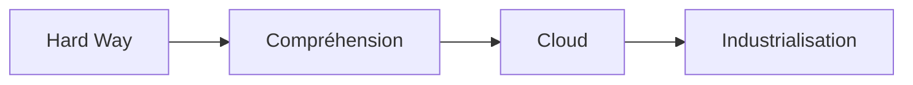
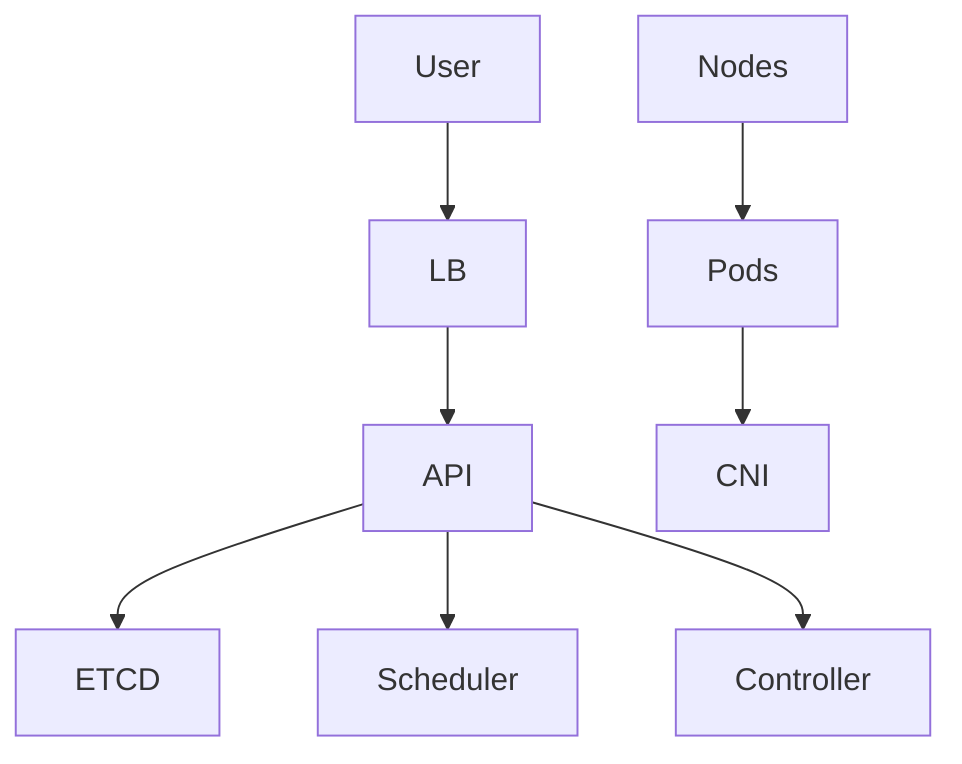
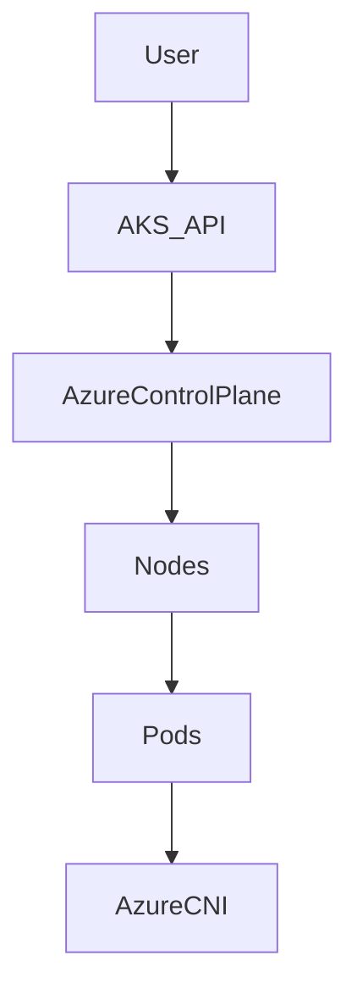
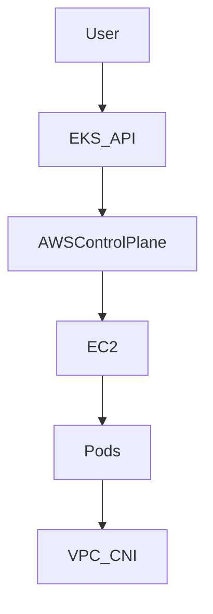
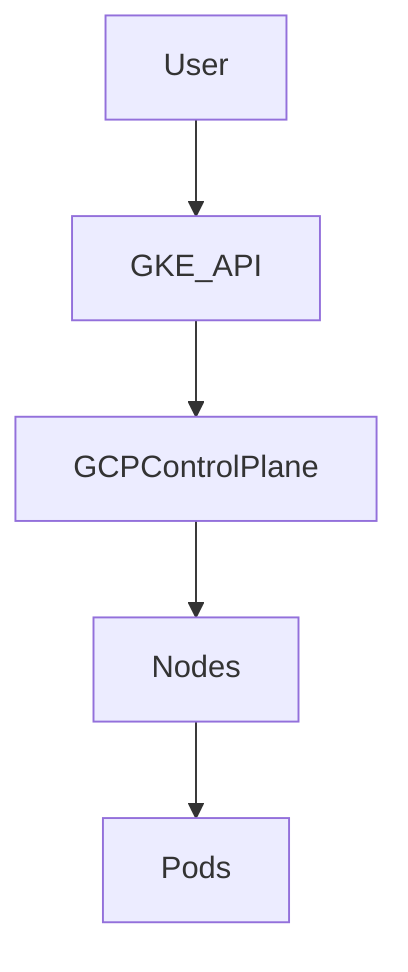
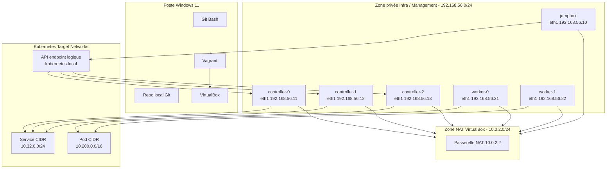
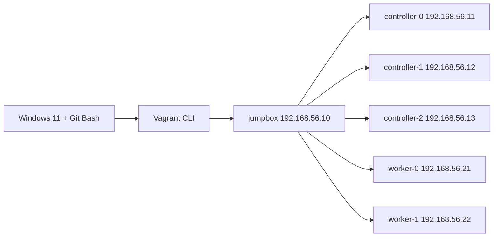
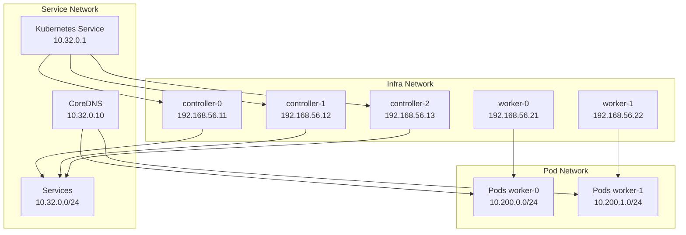
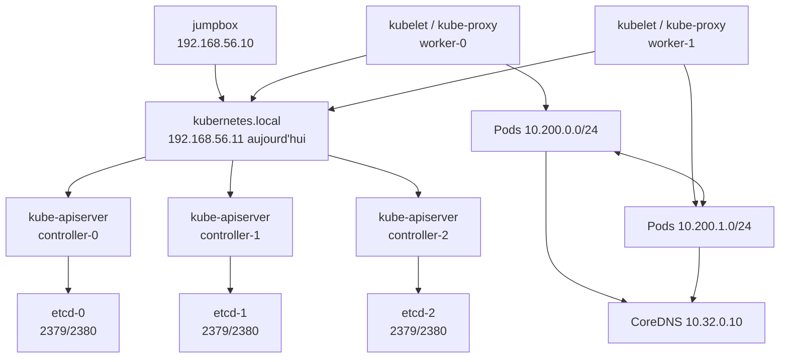

# Kubernetes V6 – Spécialisation Cloud & On-Prem (à partir du Hard Way)

## Objectif
Transformer la compréhension acquise avec **Kubernetes The Hard Way** en capacité d’architecture et d’audit sur :
- On-Prem
- Azure (AKS)
- AWS (EKS)
- GCP (GKE)

---

# 🧭 1. Principe fondamental

👉 Hard Way = comprendre **toutes les briques**
👉 Cloud = comprendre **ce qui est abstrait**



---

# 🏗️ 2. Mapping global Hard Way → Cloud

| Brique | Hard Way | Cloud managé |
|-------|---------|-------------|
| etcd | manuel | caché |
| API server | manuel | caché |
| scheduler | manuel | caché |
| controller-manager | manuel | caché |
| nodes | manuel | géré partiellement |
| réseau | manuel | plugin cloud |
| LB | manuel | LB cloud |
| stockage | manuel | CSI cloud |

👉 Le **control plane disparaît** en cloud.

---

# 🧱 3. ON-PREM (Hard Way étendu)

## Architecture



## Tu gères
- etcd
- API server
- scheduler
- controller
- kubelet
- réseau
- stockage

## Ajouts obligatoires
- Ingress (NGINX / Traefik)
- CSI (Ceph / NFS)
- monitoring
- logging

## Audit
- certificats
- etcd backup
- CNI
- HA

---

# ☁️ 4. AZURE AKS

## Architecture



## Ce qui disparaît
- etcd
- API server
- scheduler
- controller-manager

## Ce que tu gères
- nodes
- workloads
- sécurité

## Commandes
```bash
az aks create --resource-group rg --name aks --node-count 2
az aks get-credentials --resource-group rg --name aks
```

## Spécificités
- Azure CNI
- Managed Identity
- NSG

## Audit
- RBAC Azure AD
- réseau VNet
- quotas

---

# ☁️ 5. AWS EKS

## Architecture



## Commande
```bash
eksctl create cluster --name eks-cluster
```

## Spécificités
- IAM
- Security Groups
- VPC

## Audit
- IAM mapping
- network
- autoscaling

---

# ☁️ 6. GCP GKE

## Architecture



## Commande
```bash
gcloud container clusters create gke-cluster --num-nodes=2
```

## Spécificités
- Workload Identity
- Autopilot

## Audit
- IAM
- quotas
- réseau

---

# 🔥 7. Comparaison

| Critère | On-Prem | AKS | EKS | GKE |
|--------|--------|-----|-----|-----|
| contrôle | total | partiel | partiel | faible |
| complexité | élevée | moyenne | moyenne | faible |
| maintenance | élevée | faible | moyenne | faible |

---

# 🧠 8. Vision architecte

👉 On-Prem = maîtrise technique totale
👉 Cloud = maîtrise des abstractions

---

# 🔍 9. Audit multi-environnement

## On-Prem
- etcd
- certs
- control plane

## Cloud
- IAM
- réseau
- coût

---

# 🏁 Conclusion

👉 Hard Way → comprendre Kubernetes
👉 Cloud → exploiter Kubernetes à l’échelle

---

# 🚀 Suite possible

- audit cloud complet
- scénarios réels entreprise
- optimisation coûts / sécurité


---

# Annexe — Schéma réseau détaillé de la plateforme On-Prem Vagrant

## Objectif du schéma réseau
Ce chapitre décrit **l’architecture réseau réelle** de la plateforme Vagrant actuellement démarrée, puis la **cible réseau Kubernetes** que cette plateforme doit supporter.

Il sert à :
- comprendre les zones réseau,
- visualiser les interfaces de chaque VM,
- identifier les flux critiques,
- préparer le bootstrap Kubernetes,
- préparer un audit réseau de la plateforme.

---

## Vue HLD — architecture réseau globale



---

## Vue LLD — interfaces et adresses IP réelles

### Réseau NAT VirtualBox (eth0)
Toutes les VM possèdent une interface `eth0` en NAT pour accéder à Internet.

| VM | Interface | Adresse | Rôle |
|---|---|---:|---|
| jumpbox | eth0 | 10.0.2.15/24 | accès Internet / paquets |
| controller-0 | eth0 | 10.0.2.15/24 | accès Internet / paquets |
| controller-1 | eth0 | 10.0.2.15/24 | accès Internet / paquets |
| controller-2 | eth0 | 10.0.2.15/24 | accès Internet / paquets |
| worker-0 | eth0 | 10.0.2.15/24 | accès Internet / paquets |
| worker-1 | eth0 | 10.0.2.15/24 | accès Internet / paquets |

### Réseau privé VirtualBox / Infra (eth1)
C’est le réseau **réellement utilisé** pour Kubernetes.

| VM | Interface | Adresse | Rôle |
|---|---|---:|---|
| jumpbox | eth1 | 192.168.56.10/24 | administration / bastion |
| controller-0 | eth1 | 192.168.56.11/24 | control plane |
| controller-1 | eth1 | 192.168.56.12/24 | control plane |
| controller-2 | eth1 | 192.168.56.13/24 | control plane |
| worker-0 | eth1 | 192.168.56.21/24 | exécution workloads |
| worker-1 | eth1 | 192.168.56.22/24 | exécution workloads |

---

## Nommage et résolution de noms

### Noms de machines
- `jumpbox`
- `controller-0`
- `controller-1`
- `controller-2`
- `worker-0`
- `worker-1`

### Résolution actuelle
À ce stade, la résolution de noms repose sur `/etc/hosts`, pas sur un DNS d’infrastructure central.

### Entrées recommandées
```text
192.168.56.10 jumpbox
192.168.56.11 controller-0
192.168.56.12 controller-1
192.168.56.13 controller-2
192.168.56.21 worker-0
192.168.56.22 worker-1
```

### Point d’attention
Il faudra propager ces entrées sur **toutes** les VM, pas seulement sur la jumpbox.

---

## Schéma détaillé des flux d’administration



### Rôle de la jumpbox
La jumpbox sert de :
- bastion d’administration,
- machine de génération des certificats,
- machine de génération des kubeconfigs,
- poste `kubectl`,
- point de départ des copies `scp` et connexions `ssh`.

---

## Réseau Kubernetes cible

### Réseau d’infrastructure
- `192.168.56.0/24`

### Réseau Pods global
- `10.200.0.0/16`

### Sous-réseaux Pods par worker
- `worker-0` → `10.200.0.0/24`
- `worker-1` → `10.200.1.0/24`

### Réseau Services
- `10.32.0.0/24`

### Endpoint API logique
- `kubernetes.local`
- IP actuelle logique : `192.168.56.11`

### Schéma de superposition


---

## Ports et flux critiques

### Flux d’administration
| Source | Destination | Port | Protocole | Usage |
|---|---|---:|---|---|
| Windows host | Vagrant/VirtualBox | local | divers | orchestration locale |
| jumpbox | controllers/workers | 22 | TCP | SSH / SCP |

### Control plane
| Source | Destination | Port | Protocole | Usage |
|---|---|---:|---|---|
| kubectl / kubelets / composants | API server | 6443 | TCP | API Kubernetes |
| API server | etcd | 2379 | TCP | accès client etcd |
| etcd peer | etcd peer | 2380 | TCP | réplication etcd |
| API server | kubelet | 10250 | TCP | logs / exec / metrics |
| controller-manager | local secure endpoint | 10257 | TCP | diagnostics sécurisés |
| scheduler | local secure endpoint | 10259 | TCP | diagnostics sécurisés |

### Réseau cluster
| Source | Destination | Port | Protocole | Usage |
|---|---|---:|---|---|
| Pod | Pod | divers | L3/L4 | trafic applicatif |
| Pod | CoreDNS | 53 | UDP/TCP | résolution DNS |
| Client | NodePort | 30000-32767 | TCP/UDP | exposition éventuelle |

---

## Table de routage cible

### Situation actuelle
Le réseau d’infrastructure `192.168.56.0/24` est directement joignable entre toutes les VMs via `eth1`.

### Ce qu’il faudra ajouter
Pour que les Pods communiquent entre workers, il faudra que chaque nœud sache joindre les sous-réseaux Pod des autres nœuds.

### Cible recommandée
- `worker-0` porte `10.200.0.0/24`
- `worker-1` porte `10.200.1.0/24`

### Exemple conceptuel de routes
Sur les nœuds qui doivent joindre `worker-0` :
```bash
ip route add 10.200.0.0/24 via 192.168.56.21
```

Sur les nœuds qui doivent joindre `worker-1` :
```bash
ip route add 10.200.1.0/24 via 192.168.56.22
```

### Pourquoi
Sans ces routes, le trafic **Pod-to-Pod inter-worker** ne saura pas où aller.

---

## Vue détaillée des rôles réseau par machine

### jumpbox
- point d’administration
- génération de la PKI
- génération des kubeconfigs
- `kubectl`
- bastion SSH

### controller-0
- API server
- etcd membre 1
- scheduler
- controller-manager
- point API logique initial

### controller-1
- API server
- etcd membre 2
- scheduler
- controller-manager

### controller-2
- API server
- etcd membre 3
- scheduler
- controller-manager

### worker-0
- kubelet
- kube-proxy
- containerd
- CNI
- héberge Pods `10.200.0.0/24`

### worker-1
- kubelet
- kube-proxy
- containerd
- CNI
- héberge Pods `10.200.1.0/24`

---

## Schéma des flux Kubernetes cibles



---

## Points validés à ce stade

### Déjà validé
- toutes les VMs sont démarrées,
- les hostnames sont corrects,
- le swap est désactivé,
- le réseau privé `192.168.56.0/24` est fonctionnel,
- la jumpbox résout les noms et ping toutes les machines,
- l’inventaire on-prem est généré.

### À corriger / compléter
- propager `/etc/hosts` à toutes les VMs,
- corriger le script `prepare-hosts.sh` pour `br_netfilter`,
- définir une vraie stratégie pour `kubernetes.local` (hosts ou LB local),
- poser les routes Pod au moment du bootstrap réseau.

---

## Point d’attention sur `br_netfilter`

Le message vu pendant `prepare-hosts.sh` :
```text
bash: line 1: br_netfilter: command not found
```
indique que le script appelle mal le module.

### La bonne logique est :
```bash
sudo modprobe br_netfilter
lsmod | grep br_netfilter
sysctl net.bridge.bridge-nf-call-iptables
```

### Pourquoi ce module est important
Il permet au trafic bridge Linux d’être vu par iptables, ce qui est souvent nécessaire pour le réseau Kubernetes.

---

## Checklist d’audit réseau de la plateforme

### Infrastructure
- [ ] toutes les VMs ont `eth0` NAT et `eth1` privé
- [ ] les IP privées sont stables
- [ ] les hostnames sont cohérents
- [ ] `/etc/hosts` est homogène sur toutes les machines

### Connectivité
- [ ] jumpbox → controllers/workers OK
- [ ] controllers ↔ workers OK
- [ ] controllers ↔ controllers OK
- [ ] workers ↔ workers OK

### Pré-requis noyau / réseau
- [ ] `ip_forward=1`
- [ ] `net.bridge.bridge-nf-call-iptables=1`
- [ ] `br_netfilter` chargé correctement
- [ ] swap désactivé

### Kubernetes cible
- [ ] `kubernetes.local` défini proprement
- [ ] Pod CIDR connu
- [ ] Service CIDR connu
- [ ] stratégie de routage Pod prête

---

## Lecture architecte finale

Cette plateforme on-prem locale repose sur une logique en 3 couches :

### Couche 1 — IaaS locale
- Windows 11
- VirtualBox
- Vagrant

### Couche 2 — Infrastructure Linux
- 6 VMs Ubuntu 22.04
- réseau NAT pour l’accès Internet
- réseau privé `192.168.56.0/24` pour le cluster

### Couche 3 — Kubernetes cible
- control plane HA sur 3 controllers
- workers dédiés
- Pod network `10.200.0.0/16`
- Service network `10.32.0.0/24`

### Résumé ultra court
```text
Windows/Vagrant/VirtualBox
→ VMs Ubuntu
→ réseau privé 192.168.56.0/24
→ control plane HA + workers
→ Pods 10.200.0.0/16
→ Services 10.32.0.0/24
```

